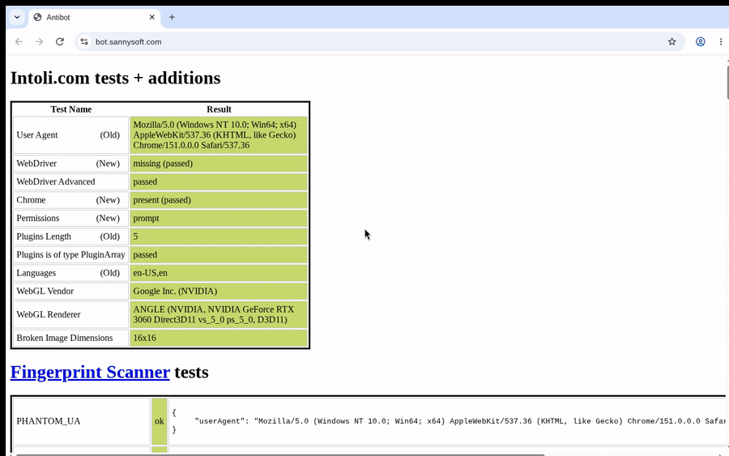
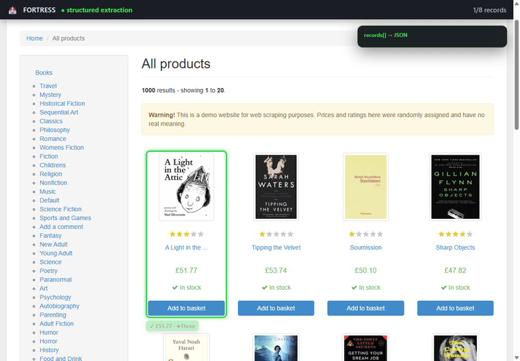
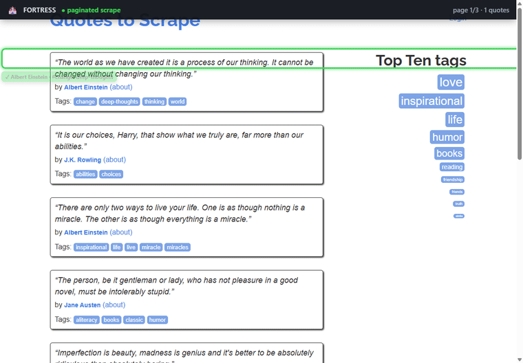
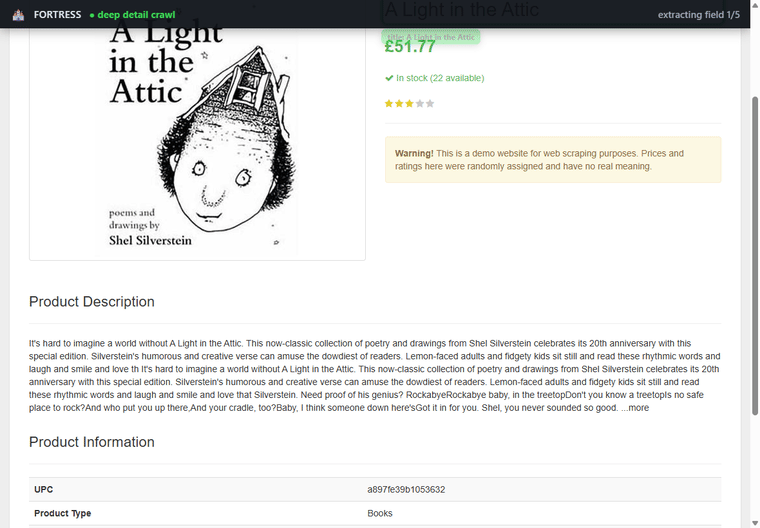
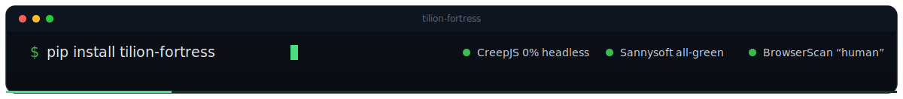
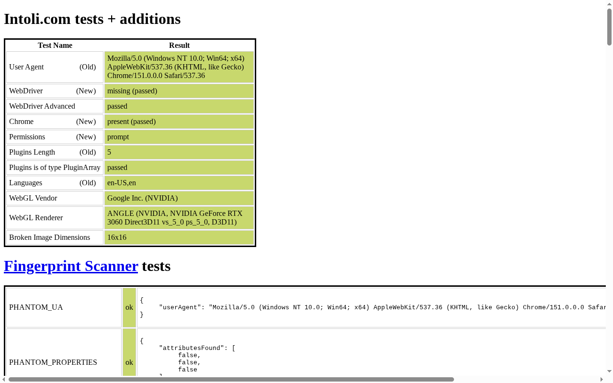
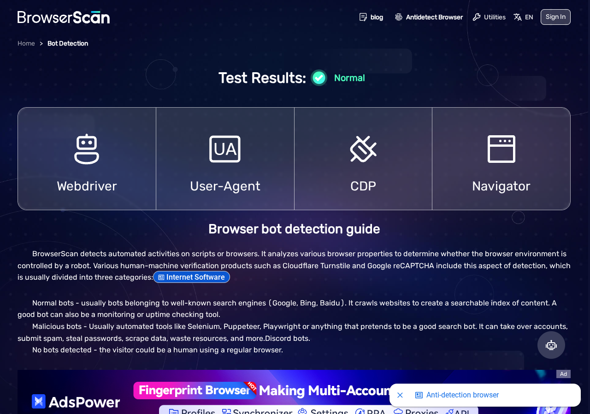
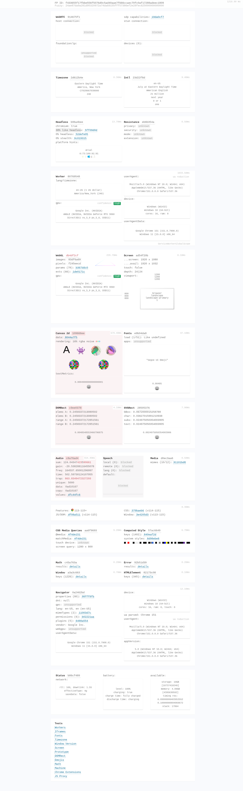
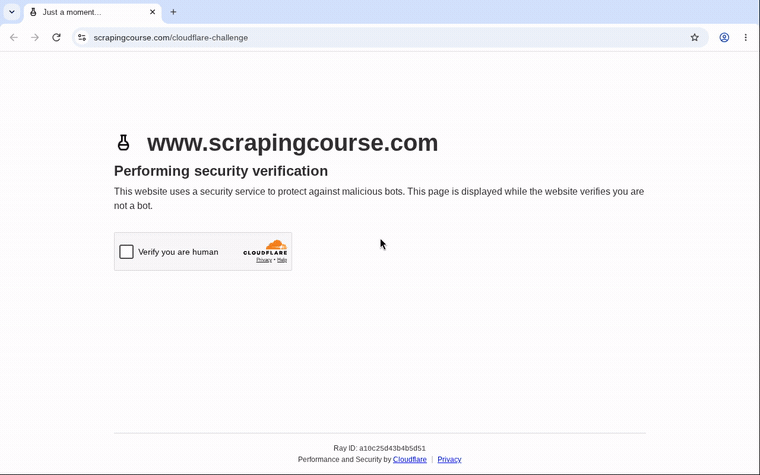

<div align="center">


### One browser engine to rule them all

Stealth Chromium engine

**Fortress is a stealth Chromium engine that stops your scrapers and browser agents from getting blocked, with one line of code change.** Bot detectors flag automation by reading the browser fingerprint; Fortress corrects that fingerprint inside Chromium's C++, so the browser presents as an ordinary Chrome install. Scrapers finish their runs, agents reach the pages they were sent to, and CreepJS, Sannysoft, BrowserScan, and live Cloudflare Turnstile all read it as human. Point your existing Playwright or Puppeteer at Fortress over CDP, and nothing else in your code changes.

<sub>**Blink · V8 · BoringSSL** patched in-tree · **ANGLE / D3D11**-backed WebGL · **JA3/JA4-coherent** TLS · **monthly** upstream rebase · **reproducible, gauntlet-gated** releases</sub>

[](CHROMIUM_VERSION)
[](https://pypi.org/project/tilion-fortress/)
[](https://www.npmjs.com/package/tilion-fortress)
[](https://hub.docker.com/r/tilion/fortress)
[](docs/GAUNTLET_RESULTS.md)
[](docs/GAUNTLET_RESULTS.md)
[](LICENSE)
[](https://github.com/tiliondev/fortress/stargazers)

[](https://chatgpt.com/?q=Help%20me%20set%20up%20Fortress%2C%20an%20open-source%20stealth%20Chromium%20engine%2C%20for%20my%20browser%20automation.%20First%20read%20the%20setup%20guide%20at%20https%3A%2F%2Fgithub.com%2Ftiliondev%2Ffortress%2Fblob%2Fmain%2FAGENTS.md%20then%20walk%20me%20through%3A%201%29%20launching%20Fortress%20%28Docker%3A%20docker%20run%20-d%20--rm%20-p%209222%3A9222%20tilion%2Ffortress%3Alatest%2C%20or%20pip%2Fnpm%20install%20tilion-fortress%29%2C%202%29%20connecting%20my%20Playwright%20or%20Puppeteer%20code%20over%20CDP%20to%20http%3A%2F%2Flocalhost%3A9222%2C%203%29%20keeping%20my%20existing%20automation%20logic.%20Do%20NOT%20add%20puppeteer-stealth%20or%20JS%20fingerprint%20patches%20%E2%80%94%20Fortress%20spoofs%20the%20fingerprint%20in%20the%20engine%27s%20C%2B%2B.) [](https://claude.ai/new?q=Help%20me%20set%20up%20Fortress%2C%20an%20open-source%20stealth%20Chromium%20engine%2C%20for%20my%20browser%20automation.%20First%20read%20the%20setup%20guide%20at%20https%3A%2F%2Fgithub.com%2Ftiliondev%2Ffortress%2Fblob%2Fmain%2FAGENTS.md%20then%20walk%20me%20through%3A%201%29%20launching%20Fortress%20%28Docker%3A%20docker%20run%20-d%20--rm%20-p%209222%3A9222%20tilion%2Ffortress%3Alatest%2C%20or%20pip%2Fnpm%20install%20tilion-fortress%29%2C%202%29%20connecting%20my%20Playwright%20or%20Puppeteer%20code%20over%20CDP%20to%20http%3A%2F%2Flocalhost%3A9222%2C%203%29%20keeping%20my%20existing%20automation%20logic.%20Do%20NOT%20add%20puppeteer-stealth%20or%20JS%20fingerprint%20patches%20%E2%80%94%20Fortress%20spoofs%20the%20fingerprint%20in%20the%20engine%27s%20C%2B%2B.) [](https://gemini.google.com/app?q=Help%20me%20set%20up%20Fortress%2C%20an%20open-source%20stealth%20Chromium%20engine%2C%20for%20my%20browser%20automation.%20First%20read%20the%20setup%20guide%20at%20https%3A%2F%2Fgithub.com%2Ftiliondev%2Ffortress%2Fblob%2Fmain%2FAGENTS.md%20then%20walk%20me%20through%3A%201%29%20launching%20Fortress%20%28Docker%3A%20docker%20run%20-d%20--rm%20-p%209222%3A9222%20tilion%2Ffortress%3Alatest%2C%20or%20pip%2Fnpm%20install%20tilion-fortress%29%2C%202%29%20connecting%20my%20Playwright%20or%20Puppeteer%20code%20over%20CDP%20to%20http%3A%2F%2Flocalhost%3A9222%2C%203%29%20keeping%20my%20existing%20automation%20logic.%20Do%20NOT%20add%20puppeteer-stealth%20or%20JS%20fingerprint%20patches%20%E2%80%94%20Fortress%20spoofs%20the%20fingerprint%20in%20the%20engine%27s%20C%2B%2B.) [](https://raw.githubusercontent.com/tiliondev/fortress/main/AGENTS.md) [](https://raw.githubusercontent.com/tiliondev/fortress/main/llms.txt)

<table align="center"><tr>
<td align="center" width="150"><h3>34</h3><sub>single-surface<br/>C++ patches</sub></td>
<td align="center" width="150"><h3>0%</h3><sub>CreepJS<br/>headless / stealth</sub></td>
<td align="center" width="160"><h3><code>[native&nbsp;code]</code></h3><sub>across every<br/>realm</sub></td>
<td align="center" width="150"><h3>BSD-3</h3><sub>open engine,<br/>rebuild it yourself</sub></td>
</tr></table>

<p align="center"></p>

<sub><i>Unedited capture of the Fortress binary in a real window: it clears a live <b>Cloudflare</b> challenge, turns <b>bot.sannysoft.com</b> all green, then reads <b>BrowserScan</b> “Normal”. Reproduce with <code>tools/gauntlet.py</code>.</i></sub>

</div>

<table>
<tr>
<td width="33%" valign="top">

#### Native-code parity
Every spoofed getter *is* a C++ getter: `toString` returns `[native code]`, **realm-invariant** across main frame, iframes, and Web Workers.

</td>
<td width="33%" valign="top">

#### Drop-in CDP
**nodriver-style** raw CDP on `:9222`, with no `Runtime.enable` leak. Keep Playwright, Puppeteer, or any CDP client; swap the browser, keep your code.

</td>
<td width="33%" valign="top">

#### Clears the gauntlet
**0% headless** on CreepJS; Sannysoft, BrowserScan, and live Cloudflare Turnstile cleared, all as a stock Chrome install.

</td>
</tr>
<tr>
<td width="33%" valign="top">

#### Auditable patches
34 small single-purpose diffs in `patches/`. Read one in a minute; rebuild the engine with one script.

</td>
<td width="33%" valign="top">

#### Coherent by construction
Real V8, Blink, and BoringSSL keep engine, user-agent, and **JA3/JA4 TLS shape** in agreement: a Windows persona on a matching stack.

</td>
<td width="33%" valign="top">

#### Tunable persona
One binary, a **coherence-checked** Windows identity; `--uxr-*` switches override any surface: GPU, screen, timezone, hardware, Client-Hints.

</td>
</tr>
</table>

---

## Contents

| | |
|---|---|
| **[What it is](#what-it-is)** · **[Quick start](#quick-start)** | what it is, install, first script, AI-agent setup |
| **[Why patch the engine, not the page](#why-patch-the-engine-not-the-page)** | the self-revealing-JS thesis + the three detection layers |
| **[How Fortress compares](#how-fortress-compares)** | vs puppeteer-stealth · Camoufox · CloakBrowser · closed vendors |
| **[Proof: live-detector results](#proof-live-detector-results)** | CreepJS / Sannysoft / BrowserScan / Cloudflare, with screenshots |
| **[Configure the persona](#configure-the-persona)** | the `--uxr-*` fingerprint surface |
| **[Works with your stack](#works-with-your-stack)** | browser-use · Crawl4AI · Stagehand · LangChain |
| **[Build & verify](#build--verify)** | reproduce from source, verify provenance |
| **[Reference](#reference)** | troubleshooting · FAQ · roadmap · repo layout |

---

## What it is

Fortress is a Chromium fork that spoofs the browser fingerprint from inside the engine. The surfaces bot detectors read (canvas, WebGL, audio, fonts, navigator, and about thirty more) are corrected in Chromium's **C++**, with no JavaScript patch layer sitting on top for a page to catch.

It ships as an ordinary browser binary that exposes a CDP endpoint. Point Playwright, Puppeteer, or any CDP client at it and your existing automation runs unchanged.

A JavaScript stealth patch leaves an extra layer the page can find: `.toString()` shows the override's source, and re-grabbing the same primitive from an iframe or worker reaches past it. Fortress corrects the surface in the engine instead, so `navigator.vendor` resolves to the real C++ getter, reports `[native code]`, and reads the same from every realm. A page inspecting itself sees stock Chromium. That is why your automation gets through where it used to get flagged, and whatever blocking is left traces to your proxies and behavior rather than the browser. [Why patch the engine, not the page](#why-patch-the-engine-not-the-page) covers the detection mechanics in full.

```python
from tilion_fortress import Fortress
from playwright.sync_api import sync_playwright

with Fortress() as f:                                   # launches the stealth engine on a CDP endpoint
    with sync_playwright() as p:
        browser = p.chromium.connect_over_cdp(f.cdp_url)
        page = browser.new_page()
        page.goto("https://bot.sannysoft.com")
        page.screenshot(path="all-green.png")
```
```js
import { Fortress } from "tilion-fortress";
import { chromium } from "playwright";

const f = await Fortress.launch();                      // stealth engine on a CDP endpoint
const browser = await chromium.connectOverCDP(f.cdpUrl);
const page = await browser.newPage();
await page.goto("https://browserscan.net");
await browser.close();
await f.close();
```

<div align="center">

### Real scraping, fully headless

<sub>Unedited captures of the Fortress engine driven over CDP. No stealth plugins, no JS patches: the fingerprint is corrected in the binary. Reproduce any of these with <a href="examples/scrape_demos.py"><code>examples/scrape_demos.py</code></a>.</sub>



<sub><b>Structured extraction</b>: records build into typed JSON as each item is read.</sub>

<table><tr>
<td align="center" width="50%"><br/><sub><b>Auto-pagination</b>: 30 quotes across 3 pages.</sub></td>
<td align="center" width="50%"><br/><sub><b>Deep detail crawl</b>: UPC · price · tax · stock · reviews.</sub></td>
</tr></table>

</div>

---

## Quick start

<div align="center"></div>

```bash
# Python / Node: prebuilt native binary auto-fetched (Linux x64 & Windows x64), SHA-256 verified
pip install tilion-fortress
npm  install tilion-fortress

# Any OS via Docker: raw CDP on :9222  (~302 MB pull / 851 MB on disk, stripped single-layer)
docker run --rm -p 9222:9222 tilion/fortress:latest

# Portable bundle (extract-and-run, like a Chromium snapshot)
tar xzf tilion-fortress-linux-x64.tar.gz            # Linux
./tilion-fortress/tilion --headless=new --remote-debugging-port=9222 --user-data-dir=/tmp/p

# Debian / Ubuntu
sudo apt install ./tilion-fortress_151.0.7908.0_amd64.deb && tilion https://example.com
```

> [!TIP]
> The SDK ships the compiled build **plus `patches/`**, so you can rebuild the engine yourself and verify every surface correction against the source. Downloads are SHA-256-verified against the release `SHA256SUMS` automatically.

### Drop it into your AI agent

Fortress is the browser your agent drives: raw CDP on `:9222`, no stealth plugins to wire up. There are two ways in.

**Option 1: open it pre-loaded in a chat assistant.** One click; it reads our [AGENTS.md](AGENTS.md) and walks you through the whole setup:

[](https://chatgpt.com/?q=Help%20me%20set%20up%20Fortress%2C%20an%20open-source%20stealth%20Chromium%20engine%2C%20for%20my%20browser%20automation.%20First%20read%20the%20setup%20guide%20at%20https%3A%2F%2Fgithub.com%2Ftiliondev%2Ffortress%2Fblob%2Fmain%2FAGENTS.md%20then%20walk%20me%20through%3A%201%29%20launching%20Fortress%20%28Docker%3A%20docker%20run%20-d%20--rm%20-p%209222%3A9222%20tilion%2Ffortress%3Alatest%2C%20or%20pip%2Fnpm%20install%20tilion-fortress%29%2C%202%29%20connecting%20my%20Playwright%20or%20Puppeteer%20code%20over%20CDP%20to%20http%3A%2F%2Flocalhost%3A9222%2C%203%29%20keeping%20my%20existing%20automation%20logic.%20Do%20NOT%20add%20puppeteer-stealth%20or%20JS%20fingerprint%20patches%20%E2%80%94%20Fortress%20spoofs%20the%20fingerprint%20in%20the%20engine%27s%20C%2B%2B.) [](https://claude.ai/new?q=Help%20me%20set%20up%20Fortress%2C%20an%20open-source%20stealth%20Chromium%20engine%2C%20for%20my%20browser%20automation.%20First%20read%20the%20setup%20guide%20at%20https%3A%2F%2Fgithub.com%2Ftiliondev%2Ffortress%2Fblob%2Fmain%2FAGENTS.md%20then%20walk%20me%20through%3A%201%29%20launching%20Fortress%20%28Docker%3A%20docker%20run%20-d%20--rm%20-p%209222%3A9222%20tilion%2Ffortress%3Alatest%2C%20or%20pip%2Fnpm%20install%20tilion-fortress%29%2C%202%29%20connecting%20my%20Playwright%20or%20Puppeteer%20code%20over%20CDP%20to%20http%3A%2F%2Flocalhost%3A9222%2C%203%29%20keeping%20my%20existing%20automation%20logic.%20Do%20NOT%20add%20puppeteer-stealth%20or%20JS%20fingerprint%20patches%20%E2%80%94%20Fortress%20spoofs%20the%20fingerprint%20in%20the%20engine%27s%20C%2B%2B.) [](https://gemini.google.com/app?q=Help%20me%20set%20up%20Fortress%2C%20an%20open-source%20stealth%20Chromium%20engine%2C%20for%20my%20browser%20automation.%20First%20read%20the%20setup%20guide%20at%20https%3A%2F%2Fgithub.com%2Ftiliondev%2Ffortress%2Fblob%2Fmain%2FAGENTS.md%20then%20walk%20me%20through%3A%201%29%20launching%20Fortress%20%28Docker%3A%20docker%20run%20-d%20--rm%20-p%209222%3A9222%20tilion%2Ffortress%3Alatest%2C%20or%20pip%2Fnpm%20install%20tilion-fortress%29%2C%202%29%20connecting%20my%20Playwright%20or%20Puppeteer%20code%20over%20CDP%20to%20http%3A%2F%2Flocalhost%3A9222%2C%203%29%20keeping%20my%20existing%20automation%20logic.%20Do%20NOT%20add%20puppeteer-stealth%20or%20JS%20fingerprint%20patches%20%E2%80%94%20Fortress%20spoofs%20the%20fingerprint%20in%20the%20engine%27s%20C%2B%2B.) [](https://raw.githubusercontent.com/tiliondev/fortress/main/AGENTS.md)

**Option 2: Copy for agent (everything, to your clipboard).** Hit the copy icon at the **top-right of the box** below. It puts the *entire* setup context on your clipboard: what it is, install, connect, persona, and rules, all of [AGENTS.md](AGENTS.md) condensed. Paste it into Cursor, Claude Code, Copilot, ChatGPT, or any agent and it takes it from there:

```text
You're setting up Fortress, an open-source STEALTH Chromium engine, for browser automation.
It corrects the browser fingerprint (canvas, WebGL, audio, fonts, navigator, +30 more) in Chromium's
C++ and exposes raw CDP on http://localhost:9222, a drop-in for Playwright/Puppeteer. Do NOT add
puppeteer-stealth or any JS fingerprint patching (it self-reveals and undoes Fortress).

LAUNCH (pick one; all expose CDP on http://localhost:9222):
  Docker:  docker run -d --rm -p 9222:9222 tilion/fortress:latest
  Python:  pip install tilion-fortress    then  from tilion_fortress import Fortress; f=Fortress(); f.start()
  Node:    npm install tilion-fortress    then  import {Fortress} from "tilion-fortress"; const f=await Fortress.launch()

CONNECT (keep my existing automation code):
  Playwright(py):  browser = p.chromium.connect_over_cdp("http://localhost:9222")
  Playwright(js):  const browser = await chromium.connectOverCDP("http://localhost:9222")
  Puppeteer(js):   const browser = await puppeteer.connect({ browserURL: "http://localhost:9222" })
  browser-use / Crawl4AI / Stagehand / LangChain:  point their CDP endpoint at http://localhost:9222

PERSONA (optional; default is a coherent Windows identity). Override any surface with --uxr-* flags:
  --uxr-timezone=America/New_York --uxr-hw-concurrency=16 --uxr-languages=en-US,en

RULES:
  1) Drive over raw CDP (:9222); don't spawn chromedriver.
  2) Never pass --user-agent (use --uxr-ua-*); it desyncs UA vs UA-Client-Hints.
  3) No puppeteer-stealth / undetected-chromedriver / JS fingerprint patches.
  4) Blocked ~90% = my IP (datacenter), not the fingerprint. Use a residential/mobile proxy, then retry.

Now walk me through launching Fortress and wiring my automation to it.
Full guide: https://github.com/tiliondev/fortress/blob/main/AGENTS.md
```

---

## Why patch the engine, not the page

The usual approach patches `navigator.webdriver`, spoofs the WebGL vendor, and overrides `navigator.plugins` from script. CreepJS and similar detectors still flag it, and the reason is **structural**, not one more property left uncovered. A JavaScript spoof is a function standing where a native one belongs. Detectors set the returned value aside and interrogate whether the thing returning it is native:

| The tell | Why it catches a JS spoof |
|---|---|
| `toString` self-reveal | A native method stringifies to `function get vendor() { [native code] }`; an override stringifies to its own source, so one `.toString()` catches it. |
| Descriptor and `hasOwnProperty` | `getOwnPropertyDescriptor` exposes redefined props, and `hasOwnProperty('toString')` returns `true` on a tampered function where a native one returns `false`. |
| `failsTypeError` | Native getters throw a specific `TypeError` on the wrong `this`; a naive shim stays quiet, and the silence is the signal. |

Realm re-acquisition is the one that defeats every main-world patch. A detector grabs a pristine primitive from another realm and turns it on your function:

```js
const iframe = document.createElement('iframe'); document.body.appendChild(iframe);
const realToString = iframe.contentWindow.Function.prototype.toString;
realToString.call(navigator.__lookupGetter__('vendor')); // returns your source code. Caught.
```

Your main-world patch lives in a different realm from that iframe. The same trap fires from a Web Worker, a thread your main-thread shim runs *beside* rather than *inside*.

Fortress has no such layer. The getter for `navigator.vendor` **is** the C++ getter: it reports `[native code]` because it is native code, identical across every realm. Camoufox puts it well: *"there is no JavaScript hijacking to be detected."* Fortress applies the same idea to **V8 and Blink** in place of Gecko.

### The three layers of bot detection, and where Fortress fits

Modern anti-bots (Cloudflare, DataDome, Kasada, HUMAN, Akamai) read three structurally different surfaces, in three separate places. One tool rarely fixes all three:

| Layer | The tells | Where the fix lives | Fortress |
|---|---|---|---|
| **A: driver / binary artifacts** | `cdc_` ChromeDriver vars, WebDriver protocol surface | Drive raw CDP, skip chromedriver |  built to be driven this way |
| **B: CDP side-effects** | `Runtime.enable` leaks via sourceURL + init-script footprints, however clean the binary is | The control / CDP-client layer: hold back `Runtime.enable`, use `Runtime.addBinding` + isolated worlds |  no leak (verified) |
| **C: fingerprint surface** | canvas, WebGL, audio, fonts, navigator, across main frame, iframes, workers | The engine (C++), because JS overrides self-reveal |  **this is Fortress** |

Fortress is the **Layer-C engine**, built to be driven so A and B hold too. The binary alone leaves the CDP channel open. That part is on the control layer, and pretending otherwise is how you get caught.

---

## How Fortress compares

| | Stock Playwright | puppeteer-extra-stealth | undetected-chromedriver | Camoufox | CloakBrowser | **Fortress** |
|---|:---:|:---:|:---:|:---:|:---:|:---:|
| Spoof layer | none | JS injection | CDP/config patch | **C++ engine** | **C++ engine** | **C++ engine** |
| `toString` yields `[native code]` | n/a |  | n/a |  |  |  |
| Survives realm re-acquisition (iframe/worker) |  |  |  |  |  |  |
| No `Runtime.enable` leak |  |  |  |  |  |  |
| Engine = Chrome / **V8** (majority traffic) |  |  |  |  Firefox |  |  |
| Coherent Chromium TLS shape |  |  |  |  Firefox |  |  |
| **Fully open-source engine** |  |  |  |  |  latest major paywalled |  |
| Published, auditable patch series | n/a | n/a | n/a |  |  binary only |  |
| Reproducible from-source build | n/a | n/a | n/a |  |  |  |
| **States its own limits** | n/a | n/a | n/a |  |  |  |

Fortress builds on real prior art: [`fingerprint-chromium`](https://github.com/adryfish/fingerprint-chromium), [`ChromiumFish`](https://github.com/arman-bd/chromiumfish), and CloakBrowser came first, and commercial vendors (Multilogin, Kameleo, GoLogin, AdsPower, Browserbase, Surfsky) recompile Chromium behind closed source. Most of that work stays closed: the paywalled forks hand you a binary and ask you to trust it, and the vendors keep their patches in-house.

Fortress goes the other way, because **a stealth engine only stays useful when the people relying on it can see how it works.** Every surface correction lives in `patches/` as a small, single-purpose diff you can read in a minute, and the whole engine rebuilds from source with one script. When a detector finds a new tell, you trace the fix, patch it, and send it back. That feedback loop is the point, and it only works while the engine stays open enough to read, extend, and rebuild.

---

## Proof: live-detector results

*Reproduce any row with `tools/gauntlet.py --bundle ./tilion-fortress`. Verified against live detectors; re-run dated in [docs/GAUNTLET_RESULTS.md](docs/GAUNTLET_RESULTS.md).*

| Suite | Stock Chromium | **Fortress** |
|---|:---:|:---:|
| **CreepJS** | flagged headless | **0% headless · 0% stealth**, worker signals coherent |
| **bot.sannysoft.com** | red rows | **0 failed** · WebDriver Advanced passed · WebGL = NVIDIA RTX 3060 / ANGLE D3D11 |
| **browserscan.net** | bot detected | **“No bots detected, could be a human”** |
| **rebrowser bot-detector** | `Runtime.enable` LEAK | **no leak** · `webdriver=false` · clean init-scripts (raw CDP) |
| **Cloudflare Turnstile** | blocked | **bypassed**: a human click cleared a live challenge (headed, datacenter IP) |

<details open><summary><b>Proof: real, unedited screenshots</b></summary>

<br/>



| BrowserScan | CreepJS | Cloudflare |
|:---:|:---:|:---:|
|  |  |  |

</details>

---

## Configure the persona

The binary carries **zero brand strings**; the launcher applies a coherent default Windows persona. Override any surface with `--uxr-*` switches, or set `TILION_NO_DEFAULTS=1` for a bare launch.

```
--uxr-platform / --uxr-ua-platform / --uxr-ua-os / --uxr-ua-arch / --uxr-ua-bitness
--uxr-ua-platform-version / --uxr-ua-brand / --uxr-hw-concurrency / --uxr-device-memory
--uxr-webgl-vendor / --uxr-webgl-renderer / --uxr-webgl-fullparams
--uxr-canvas-seed / --uxr-audio-seed / --uxr-timezone / --uxr-languages
--uxr-screen-width / --uxr-screen-height / --uxr-webrtc-policy=disable_non_proxied_udp
```

| Env var | Purpose |
|---|---|
| `TILION_NO_DEFAULTS=1` | Skip the default persona (bare launch) |
| `TILION_TZ` / `TILION_LANG` | Quick timezone / language override |

> [!NOTE]
> **The persona rides on the command line today.** The `--uxr-*` switches are world-readable via `/proc/<pid>/cmdline`, so it's one persona per launch and visible to other processes on the host. The `MaskConfig` runtime lands next: it delivers the persona over IPC and lifts the one-per-process limit (see [what's next](#whats-next)).

---

## Works with your stack

Fortress exposes raw CDP on `:9222`, so it drops in under anything that speaks Playwright, Puppeteer, or CDP.

| Framework | Connect via |
|---|---|
| [**browser-use**](https://github.com/browser-use/browser-use) (~70k stars) | `cdp_url="http://localhost:9222"` |
| [**Crawl4AI**](https://github.com/unclecode/crawl4ai) (~58k stars) | CDP endpoint |
| [**Stagehand**](https://github.com/browserbase/stagehand) (~21k stars) | `connectOverCDP` |
| [**LangChain**](https://github.com/langchain-ai/langchain) Playwright toolkit | Playwright CDP |
| **Playwright / Puppeteer** (Python & JS) | `connect_over_cdp` / `connect` |

```python
from playwright.sync_api import sync_playwright
with sync_playwright() as p:
    browser = p.chromium.connect_over_cdp("http://localhost:9222")   # Fortress under the hood
```

---

## Build & verify

### Reproduce from source

```bash
export CHROMIUM_VERSION=$(cat CHROMIUM_VERSION)
build/build.sh                         # depot_tools, sync the tag, apply patches, gn gen, ninja
build/rebase-monthly.sh 152.0.XXXX.0   # bump + 3-way apply + rebuild + gauntlet-gate
```
Output: `out/Fortress/chrome`. The fork is 34 small single-surface patches (`patches/`), so most re-apply cleanly across upstream releases; the gauntlet then gates the release on any regression.

| Platform | Status |
|---|---|
| Linux x64 (native) · **Windows x64 (native)** · any OS via Docker |  **shipping** |
| Code-signed installers · macOS `.app` · `linux/arm64` | in progress |

### Verify it's really ours

Fortress ships from four official channels. Treat anything else as untrusted:

| | Official source |
|---|---|
| **Source** | [github.com/tiliondev/fortress](https://github.com/tiliondev/fortress) |
| **Docker** | [`tilion/fortress`](https://hub.docker.com/r/tilion/fortress) |
| **Python** | [`tilion-fortress`](https://pypi.org/project/tilion-fortress/) |
| **Node** | [`tilion-fortress`](https://www.npmjs.com/package/tilion-fortress) |

**Verify a download.** Every release ships `SHA256SUMS`, and the `pip`/`npm` SDKs run this for you on install:

```bash
BASE=https://github.com/tiliondev/fortress/releases/download/v151.0.7908.0
curl -LO $BASE/tilion-fortress-linux-x64.tar.gz
curl -Ls $BASE/SHA256SUMS | sha256sum -c --ignore-missing     # -> OK
```

**Verify the Docker image** by digest (not just the tag):

```bash
docker pull tilion/fortress:151.0.7908.0
docker inspect --format '{{index .RepoDigests 0}}' tilion/fortress:151.0.7908.0
# compare the printed sha256:... against the digest in the GitHub Release notes
```

**Or trust nothing and rebuild it.** The whole fork is 34 readable patches in `patches/`; `build/build.sh` reproduces the binary from Chromium source, so you can diff what you built against what we ship.

---

## Reference

<details><summary><b>Troubleshooting</b></summary>

<br/>

**Still blocked on Cloudflare, DataDome, or Kasada.** Most of the time this is your **IP**, not your fingerprint: a datacenter range gets flagged before any page script runs. Route egress through residential or mobile proxies and retry; if it clears, the fingerprint was fine.

**The fingerprint looks off on a Linux host.** The default persona is Windows, but the TLS shape and some OS-facing signals follow the machine underneath. Match the persona to your egress OS, or set the relevant `--uxr-*` flags so the OS story agrees with where the traffic leaves from.

**macOS pulls a Docker image.** Native Linux + Windows binaries ship today; macOS still runs Fortress through the official Docker image (`tilion/fortress`). Install Docker Desktop, or run on Linux/Windows x64 for the native binary.

**The persona shows up in `/proc/<pid>/cmdline`.** The `--uxr-*` flags are readable by other processes on the host, one persona per launch. Until the runtime `MaskConfig` lands, keep one persona per process and avoid sharing the host with untrusted code.

**A detector flags something the gauntlet passes.** Detection moves. Confirm you're on the current Chromium rebase, then open an issue with the test page. That page becomes the next patch.

</details>

<details><summary><b>FAQ</b></summary>

<br/>

**Is this legal?** Fortress is a browser engineering project for legitimate automation, testing, and scraping of publicly available data. Respect each site's ToS and the law in your jurisdiction.

**Is it really free?** Yes. BSD-3, fully open, and self-hostable. The patch series is published, so you can build the current engine from source yourself.

**Why not just use puppeteer-stealth or undetected-chromedriver?** They patch the JS/CDP layer *after* the page can inspect the browser, so they self-reveal via `toString` and realm re-acquisition. Fortress moves the spoof into C++, where the page finds native code. (See "Why patch the engine, not the page.")

**How is this different from Camoufox?** Same C++-interception idea. Camoufox forks Firefox (~3% of traffic, a standing anomaly) while Fortress forks Chromium and V8 (the majority engine), so a Chrome user-agent is coherent by construction.

**Will it pass everything forever?** No. Detection keeps moving, so we ship a dated, reproducible gauntlet and a monthly Chromium rebase; you can always see exactly what passes today.

</details>

<details><summary><b>Roadmap</b></summary>

<br/>

- [ ] Runtime JSON config into a C++ `MaskConfig` (one binary, many coherent fingerprints, nothing on the command line)
- [ ] First-party MCP server plus Puppeteer / raw-CDP SDKs (drop-in for AI agents)
- [ ] Code-signed Windows `.exe` and macOS `.app`
- [ ] `linux/arm64` Docker image
- [ ] Migrate `patches/` to Brave-style `chromium_src/` overrides
- [ ] Published reCAPTCHA v3 / DataDome / Kasada benchmark rows (dated, reproducible)

</details>

<details><summary><b>Repo layout</b></summary>

```
patches/     34 per-surface C++ patches (+ series), the source of truth for the fork
build/       args.gn, build.sh, apply-patches.sh, rebase-monthly.sh, windows/, macos/
packaging/   tilion launcher, fonts.conf, Dockerfile, .deb + bundle builders
fonts/       33 metric-compatible Windows-named fonts (incl. color emoji)
sdk/         python + node (tilion-fortress) prebuilt-binary SDKs
tools/       gauntlet.py, the CreepJS / Sannysoft / BrowserScan CI gate
docs/        GAUNTLET_RESULTS, BUILD_NATIVE, BENCHMARK
```

</details>

### Contributing

Found a detection vector or a leak we missed? Open an issue with a reproducible test page. A page that reliably flags Fortress is the most valuable thing you can send. It becomes the next patch. Two house rules: every capability claim ships with a command that reproduces it, and every limit is written down. **The word "undetectable" stays out of the repo.**

### License

BSD-3-Clause for the Fortress patches and tooling (matching Chromium). Chromium and the bundled fonts retain their own licenses; see [LICENSE](LICENSE) and [NOTICE](NOTICE). The patch series is published, so you can audit and rebuild the engine yourself.

---

<div align="center">

### What's next

</div>

> [!IMPORTANT]
> **`v2`: MaskConfig runtime personas.** An **IPC-delivered, seed-driven persona graph** feeding a process-global C++ `MaskConfig` singleton: **thousands of coherence-invariant fingerprints from a single binary**, **per-`BrowserContext` identity isolation**, and **zero command-line footprint**. The rest is on the [roadmap](#reference).

<div align="center">

### Staying current

Detection keeps moving, so a stealth engine is only as good as its last rebase. Fortress tracks the latest Chromium monthly, re-runs the full gauntlet, and ships a patch whenever a detector finds a new tell, so what you run keeps matching what a real Chrome install looks like. [Watch the releases](https://github.com/tiliondev/fortress/releases) to follow the `v2` MaskConfig work, or [star the repo](https://github.com/tiliondev/fortress/stargazers) if it's useful to you.

<a href="https://star-history.com/#tiliondev/fortress&Date">
  
</a>

<br/>

<em>Stealth you can read, rebuild, and run yourself.</em>

</div>
