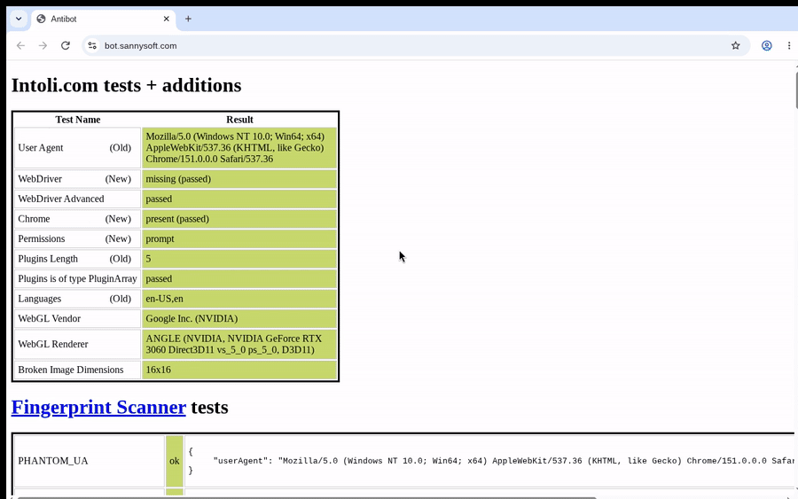
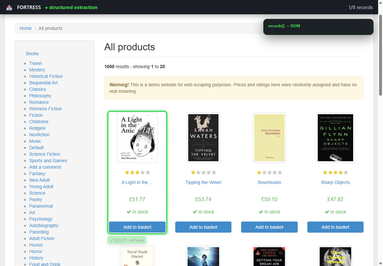
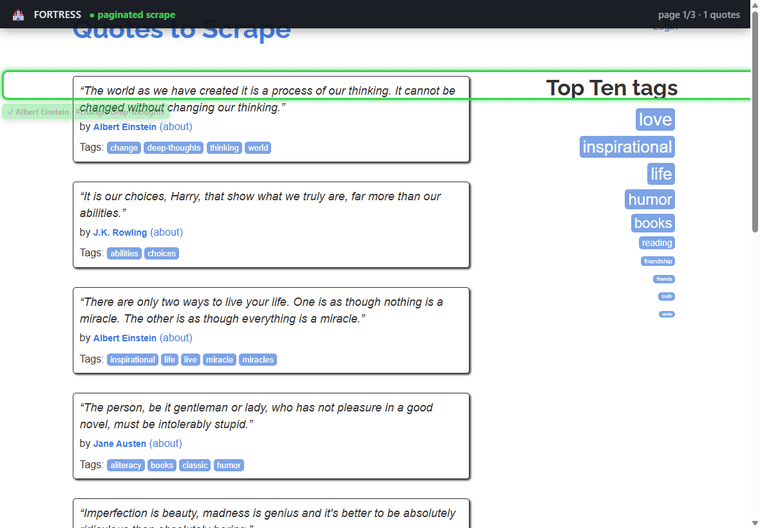
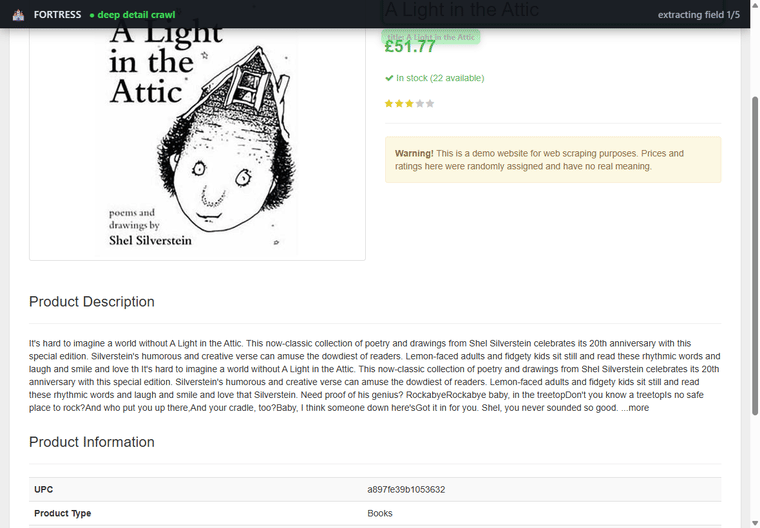
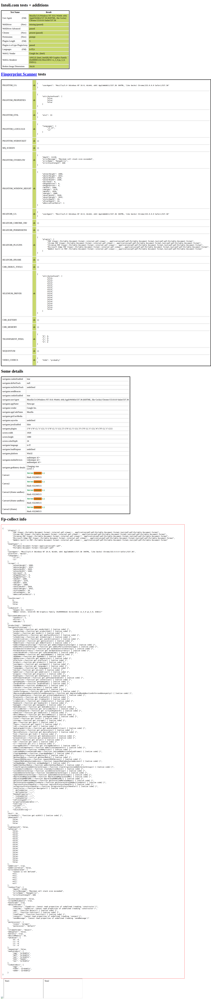
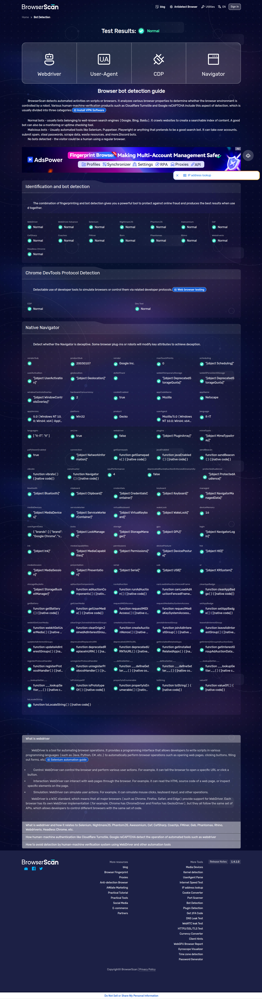
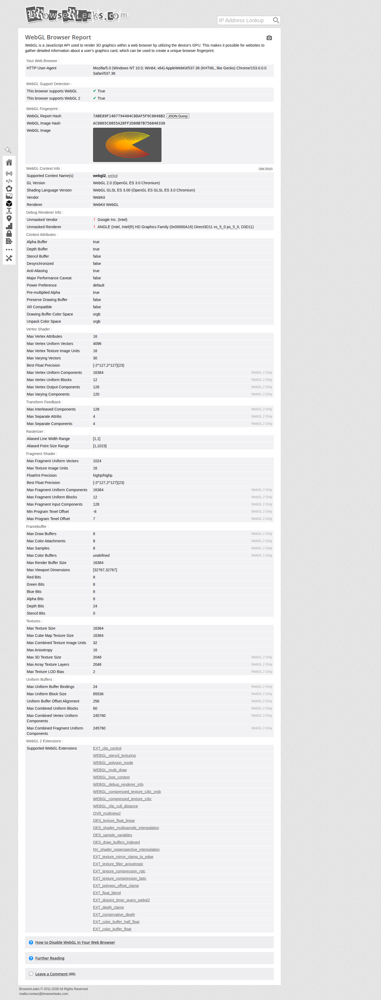
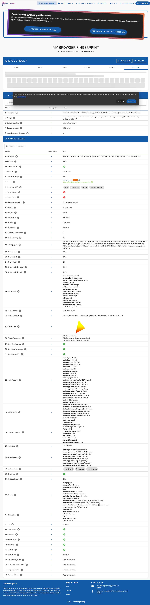

<div align="center">


### One browser engine to rule them all

Stealth Chromium engine · **v3 (Chromium 153)**

[](CHROMIUM_VERSION) [](https://hub.docker.com/r/tilion/fortress) [](https://discord.gg/bfy3fv6QT)<br/>
[](https://raw.githubusercontent.com/tiliondev/fortress/main/AGENTS.md) [](https://raw.githubusercontent.com/tiliondev/fortress/main/llms.txt) [](https://github.com/tiliondev/fortress/tree/main/mcp) [](https://www.npmjs.com/package/tilion-mcp)

**Fortress is a stealth Chromium engine that stops your scrapers and browser agents from getting blocked, with one line of code change.** Bot detectors flag automation by reading the browser fingerprint; Fortress corrects that fingerprint inside Chromium's C++, so the browser presents as an ordinary Chrome install. Scrapers finish their runs, agents reach the pages they were sent to, and CreepJS, Sannysoft, BrowserScan, and live Cloudflare Turnstile all read it as human. Point your existing Playwright or Puppeteer at Fortress over CDP, and nothing else in your code changes. With v3, every launch is a *different* coherent machine, so a fleet of sessions looks like a crowd of real users.

**Headless, on datacenter IPs, with no proxies, Fortress served 86.4% of 92 protected pages; the next best stack (Camoufox) served 74.5%.**

<sub>**Blink · V8 · BoringSSL** patched in-tree · **ANGLE / D3D11**-backed WebGL · **JA3/JA4-coherent** TLS · **monthly** upstream rebase · **reproducible, gauntlet-gated** releases</sub>

<table align="center"><tr>
<td align="center" width="150"><h3>81</h3><sub>single-surface<br/>C++ patches</sub></td>
<td align="center" width="150"><h3>0%</h3><sub>CreepJS<br/>headless / stealth</sub></td>
<td align="center" width="150"><h3>48/48</h3><sub>distinct across a<br/>64-clone fleet</sub></td>
<td align="center" width="160"><h3><code>[native&nbsp;code]</code></h3><sub>across every<br/>realm</sub></td>
</tr></table>

<p align="center"></p>

<sub><i>Unedited capture of the Fortress binary in a real window: it clears a live <b>Cloudflare</b> challenge, turns <b>bot.sannysoft.com</b> all green, then reads <b>BrowserScan</b> “Normal”. Reproduce with <code>tools/gauntlet.py</code>.</i></sub>

</div>

<table>
<tr>
<td width="33%" valign="top">

#### Native-code parity
Every spoofed getter *is* a C++ getter: `toString` returns `[native code]`, **realm-invariant** across main frame, iframes, and Web Workers.

</td>
<td width="33%" valign="top">

#### Drop-in CDP
**nodriver-style** raw CDP on `:9222`, with no `Runtime.enable` leak. Keep Playwright, Puppeteer, or any CDP client; swap the browser, keep your code.

</td>
<td width="33%" valign="top">

#### Clears the gauntlet
**0% headless** on CreepJS; Sannysoft, BrowserScan, and live Cloudflare Turnstile cleared, all as a stock Chrome install.

</td>
</tr>
<tr>
<td width="33%" valign="top">

#### IPC persona graph
The persona reaches the renderer over **IPC** into a process-global config: **zero command-line footprint**, **per-context isolation**, thousands of coherent identities from one binary. `--uxr-*` switches stay as explicit overrides.

</td>
<td width="33%" valign="top">

#### Fleet re-identity
`on_restore` re-keys the **whole** persona (canvas · audio · WebGL · GPU · screen · UA · TLS) from a snapshot with **no relaunch**. 64 clones come up **48/48 distinct**.

</td>
<td width="33%" valign="top">

#### Coherent by construction
Real V8, Blink, and BoringSSL keep engine, user-agent, and **JA3/JA4 TLS shape** in agreement, and WebGL / WebGPU agree with the persona GPU to the **parameter level**: limits, precision and extensions as well as the renderer string.

</td>
</tr>
</table>

---

## What's new: v3 · 153.0.8010.36 · Fleet Engine

v3 turns Fortress from a coherent single persona into a coherent fleet engine: 87 commits on `patches/`, a Chromium 151/152 to 153 rebase, and the changes below.

- **IPC persona graph, shipped.** The persona is delivered to the renderer over IPC into a process-global config: **zero command-line footprint** and **per-context identity isolation**, so multiple sessions or accounts in one browser never collapse into a single linkable identity.
- **`on_restore` fleet re-identity.** On snapshot resume the **entire** persona re-keys in place (RNG, canvas/audio, GPU/screen/UA, network and TLS state) with **no relaunch**, confirmed by a closed-loop per-surface ack. A **64-clone fleet comes up 48/48 distinct**, stress-gated to 500 clones.
- **Byte-exact canvas and audio.** Canvas noise is **idempotent and byte-exact across `getImageData` / `toDataURL` / `toBlob`** (and OffscreenCanvas), edge-gated to anti-aliased pixels only, with **64-bit domain-separated seeds** and a **fail-closed RNG** (a zero or absent seed disables the noise; no golden constant can leak). WebGL/WebGL2 readback, including PBO `readPixels`, routes through the same edge-gated path. Audio farble is **value-keyed**: identical inputs give identical outputs, fresh per persona yet internally stable.
- **Coherent WebGL and WebGPU.** Both agree with the persona GPU at the **parameter level**: limits, precision, extensions, and `navigator.gpu` adapter identity all match a real hardware GPU, never the software backend. **Verified live.**
- **A real font substrate.** **154 distinct bundled font families** with real metric clones and per-persona metrics; enumeration is gated to the persona so host fonts are never visible.
- **Coherence everywhere.** About thirty specific tells closed, each with a coherence rule in place of a spoof: `@media` matches screen and DPR, color-gamut and dynamic-range, `jsHeapSizeLimit` matches deviceMemory, `prefers-color-scheme` per persona (about a third dark), Windows system fonts, Device-Memory client hint on the **navigation** request path, WebAuthn `isUVPAA()` per persona, macOS zero-width overlay scrollbars, fail-closed WebRTC (no real-IP leak on a bare launch), pointer/hover/`maxTouchPoints` pinned, OS-appropriate `speechSynthesis` voices, and coherent Mac personas (Apple arch, core and RAM SKUs, a MacBook that is not permanently plugged in).
- **Recorded-human mouse motion.** An engine-native trajectory engine backed by a bank of **~10k recorded-human paths** (SapiMouse) paces the cursor with organic velocity and micro-jitter, a **~16× more human** motion signal than a raw driver (humanness gap ~4.3 vs ~70). Speed-proportional `getCoalescedEvents` batching and per-persona realtime `AudioContext` timing round out the behavioral seed.
- **Widevine EME, shipped.** The **real Widevine CDM** is bundled and enabled, so `requestMediaKeySystemAccess('com.widevine.alpha')` resolves exactly as it does in a genuine Google Chrome. The DRM gap the roadmap flagged is closed.
- **Native on more platforms.** Windows x64 ships native (`.zip` + `tillion.cmd`); Linux arm64, x86 and armhf tarballs are rolling out; the macOS `.app` builds from source.

```bash
pip install -U tilion-fortress       # or:  docker run --rm -p 9222:9222 tilion/fortress:latest
```

**[Full release notes](https://github.com/tiliondev/fortress/releases)**


## Contents

| | |
|---|---|
| **[What it is](#what-it-is)** · **[Quick start](#quick-start)** | what it is, install, first script, native builds, AI-agent setup |
| **[Every session a distinct machine](#every-session-a-distinct-machine)** | 40 back-to-back launches, 40 different coherent machines |
| **[The Fortress MCP](#the-fortress-mcp-stealth-browsing-as-agent-tools)** | 29 stealth-browser tools for AI agents (Beta) |
| **[Why patch the engine, not the page](#why-patch-the-engine-not-the-page)** | the self-revealing-JS thesis + the four detection layers |
| **[How Fortress compares](#how-fortress-compares)** | vs puppeteer-stealth · Camoufox · antidetect apps · **v2 to v3** |
| **[Proof: live-detector results](#proof-live-detector-results)** | v3 live results, CreepJS / Sannysoft / BrowserScan / WebGL / WebGPU, with screenshots |
| **[Benchmark: 92 protected sites](#benchmark-92-protected-sites-eight-stacks)** | Fortress vs seven stacks, all headless, 1,584 fresh machines, datacenter IPs |
| **[Configure the persona](#configure-the-persona)** | the IPC persona graph and the `--uxr-*` fingerprint surface |
| **[Works with your stack](#works-with-your-stack)** | browser-use · Crawl4AI · Stagehand · LangChain |
| **[Build & verify](#build--verify)** | build from source, platforms, verify provenance |
| **[Reference](#reference)** | troubleshooting · FAQ · roadmap · repo layout |

---

## What it is

Fortress is a Chromium fork that spoofs the browser fingerprint from inside the engine. The surfaces bot detectors read (canvas, WebGL, WebGPU, audio, fonts, navigator, Client-Hints, and about forty more) are corrected in Chromium's **C++**, with no JavaScript patch layer sitting on top for a page to catch.

It ships as an ordinary browser binary that exposes a CDP endpoint. Point Playwright, Puppeteer, or any CDP client at it and your existing automation runs unchanged.

A JavaScript stealth patch leaves an extra layer the page can find: `.toString()` shows the override's source, and re-grabbing the same primitive from an iframe or worker reaches past it. Fortress corrects the surface in the engine instead, so `navigator.vendor` resolves to the real C++ getter, reports `[native code]`, and reads the same from every realm. A page inspecting itself sees stock Chromium. That is why your automation gets through where it used to get flagged, and whatever blocking is left traces to your proxies and behavior rather than the browser. [Why patch the engine, not the page](#why-patch-the-engine-not-the-page) covers the detection mechanics in full.

With v3 the persona is no longer a single fixed identity. Each launch mints a fresh, internally coherent machine (GPU, screen, cores, timezone, language, fonts, all in agreement), delivered to the renderer over IPC, so nothing shows on the command line and every `BrowserContext` can hold its own identity.

```python
from tilion_fortress import Fortress
from playwright.sync_api import sync_playwright

with Fortress() as f:                                   # launches the stealth engine on a CDP endpoint
    with sync_playwright() as p:
        browser = p.chromium.connect_over_cdp(f.cdp_url)
        page = browser.new_page()
        page.goto("https://bot.sannysoft.com")
        page.screenshot(path="all-green.png")
```
```js
import { Fortress } from "tilion-fortress";
import { chromium } from "playwright";

const f = await Fortress.launch();                      // stealth engine on a CDP endpoint
const browser = await chromium.connectOverCDP(f.cdpUrl);
const page = await browser.newPage();
await page.goto("https://browserscan.net");
await browser.close();
await f.close();
```

<div align="center">

### Real scraping, fully headless

<sub>Unedited captures of the Fortress engine driven over CDP. No stealth plugins, no JS patches: the fingerprint is corrected in the binary. Reproduce any of these with <a href="https://github.com/tiliondev/fortress/blob/main/examples/scrape_demos.py"><code>examples/scrape_demos.py</code></a>.</sub>



<sub><b>Structured extraction</b>: records build into typed JSON as each item is read.</sub>

<table><tr>
<td align="center" width="50%"><br/><sub><b>Auto-pagination</b>: 30 quotes across 3 pages.</sub></td>
<td align="center" width="50%"><br/><sub><b>Deep detail crawl</b>: UPC · price · tax · stock · reviews.</sub></td>
</tr></table>

</div>

<div align="center">

### Clears real Akamai, before and after


<sub>Same residential IP, same site (<b>aa.com</b> · Akamai Bot Manager). A stock/headless browser gets <b>Access Denied</b> (Reference&nbsp;#); Fortress loads the real page and Akamai issues its <code>_abck</code> sensor cookie; the Bot Manager accepts it as a real browser. The IP is the same in both runs, so the variable is the <b>fingerprint</b>.</sub>

<sub>The same before and after holds on lowes.com, macys.com and kohls.com, every run from the same residential IP.</sub>

</div>

---

## Every session a distinct machine

40 back-to-back launches of the **same v3 binary**, headless. Each one is a *different*, internally coherent machine, and **no two sessions shared a canvas or audio fingerprint**:

| Across 40 launches | Distinct |
|---|:---:|
| **Canvas** fingerprint | **40 / 40** |
| **Audio** fingerprint | **40 / 40** |
| GPU (WebGL renderer) | 25 |
| Screen resolution | 14 |
| Timezone (geo-coherent with language) | 23 |
| Platform mix | 31 Windows · 9 macOS |

| # | Platform | GPU | Screen | Cores | Timezone | Lang | Canvas |
|---|---|---|---|:---:|---|---|---|
| 1 | Win32 | Intel UHD Graphics | 1536×864 | 2 | Europe/Warsaw | pl-PL | `78ae7500` |
| 2 | Win32 | Intel HD Graphics 4600 | 1920×1080 | 4 | Asia/Seoul | ko-KR | `6dcc5a20` |
| 3 | Win32 | Intel UHD Graphics 620 | 1920×1080 | 12 | America/Buenos_Aires | es-AR | `deddd100` |
| 4 | Win32 | Intel UHD Graphics | 1920×1080 | 6 | Europe/Paris | fr-FR | `643e08d8` |
| 5 | Win32 | Intel UHD Graphics | 2560×1440 | 8 | America/New_York | en-US | `56e37548` |
| 6 | Win32 | AMD Radeon 860M | 1707×960 | 8 | Asia/Makassar | id-ID | `bbaacff0` |
| 7 | Win32 | Intel UHD Graphics | 1536×864 | 8 | America/Sao_Paulo | pt-BR | `b1d2ec50` |
| 8 | Win32 | Intel Iris Xe Graphics | 2560×1440 | 12 | Asia/Calcutta | hi-IN | `89d61698` |
| 9 | **MacIntel** | Apple M1 Pro (Metal) | 1728×1117 | 10 | America/Chicago | en-US | `a975f300` |
| 10 | **MacIntel** | Apple M4 (Metal) | 1512×982 | 10 | America/Denver | en-US | `9f03f6f8` |

*…30 more, all distinct. Every row is a coherent machine: GPU, screen, core count, timezone and language agree (Windows with Intel/AMD/D3D11, macOS with Apple/Metal; timezone, language and region matched). Reproduce with `tools/gauntlet.py --runs 40`.*

---

## Quick start

```bash
# Python / Node: prebuilt native binary auto-fetched (Linux x64 & Windows x64), SHA-256 verified
pip install tilion-fortress
npm  install tilion-fortress

# Any OS via Docker: raw CDP on :9222
docker run --rm -p 9222:9222 tilion/fortress:latest

# Portable tarball (Linux x64 / arm64 / x86 / armhf): use it like a Chromium snapshot
tar xzf fortress-v153-linux-x64.tar.gz
./fortress-v153/tilion https://example.com
./fortress-v153/tilion --headless=new --remote-debugging-port=9222 --user-data-dir=/tmp/p

# Native Windows x64: unzip and launch via the .cmd (raw CDP, same --uxr-* overrides)
#   fortress-v153-win-x64\tillion.cmd --headless=new --remote-debugging-port=9222 --user-data-dir=C:\tmp\p

# Debian / Ubuntu
sudo apt install ./tilion-fortress_153.0.8010.36_amd64.deb && tilion https://example.com
```

> [!TIP]
> The SDK ships the **compiled v3 engine**, ready to run, and downloads are SHA-256-verified against the release `SHA256SUMS` automatically. The **first-generation patch series is public** to read and rebuild.

### Free for developers, unlock in one command

**Fortress v3 is free for developers, with no machine, session, or concurrency caps.** One ten-second step turns a fresh install into the full engine: sign in with GitHub, Google, or email so we know who our developers are.

```bash
tilion activate      # opens your browser, sign in, done. Key saved to ~/.tilion/license.jwt
```

The key is verified offline after that; Fortress never phones home or reports usage. Skip activation and Fortress still runs: it prints one line and falls back to the public first-generation engine until you activate.

| | |
|---|---|
|  **Developers** | Free and unlimited. Each developer gets a unique key that auto-refreshes, so you activate once. |
|  **CI, Docker, AI agents** (no browser) | Set `TILION_LICENSE_KEY=<key>` in the environment, or run `tilion activate --token <key>`. One key covers a whole fleet. |
|  **Enterprise** | A production key from [tilion.com/pricing](https://tilion.com/pricing) for your org's fleet. Drop it in `TILION_LICENSE_KEY`. |

#### The `tilion` CLI

`pip install tilion-fortress` (or `npm install tilion-fortress`) puts the `tilion` command on your `PATH`. The portable tarball and the Docker image bundle the same activator, so it works everywhere with no extra install.

| Command | What it does |
|---|---|
| `tilion activate` | Unlock v3 with a one-click device flow (browser sign-in) |
| `tilion activate --headless` | Same flow, prints the URL and code (SSH or remote hosts) |
| `tilion activate --token <jwt>` | Save a key with no browser (CI, agents) |
| `tilion license status [--json]` | Show the saved key's tier and expiry (`--json` for scripts) |
| `tilion license refresh` | Re-issue the key before it expires |
| `tilion license logout` | Remove the saved key and drop back to v1 |
| `tilion get [platform]` | Download the build for this host. `tilion get list` shows all: `linux-x64`, `arm64`, `armhf`, `x86`, `win-x64`, `mac-arm64`, `mac-x64` |
| `tilion mcp` | Run the Fortress **MCP server**, stealth browsing as agent tools |
| `tilion` `[--port N]` | Launch the engine and print the CDP endpoint |

### Native builds: one engine, every platform

The **same v3 engine** ships as a native binary per platform, no container hop, from [**Releases**](https://github.com/tiliondev/fortress/releases). Each launch mints a fresh, coherent machine for that OS: a Windows build draws Windows personas (Win32 · D3D11 GPUs), verified 10/10.

| Platform | Package | Widevine | Status |
|---|---|:---:|---|
| **Linux x64** | portable tarball · Docker · pip / npm |  |  **shipping** |
| **Windows x64** | portable `.zip` + `tillion.cmd` launcher |  |  **shipping** |
| **Linux arm64** | portable tarball (Graviton, dense cloud fleets) | no |  **shipping** |
| **Linux x86 · armhf** | portable tarball (32-bit x86 / ARM) | no |  **shipping** |
| **macOS** (arm64 / x64) | `.app`, built from source |  | build from source |

<sub>All four Linux builds (x64 · arm64 · armhf · x86) and Windows x64 carry the same license gate; the 32-bit and arm64 cross-builds ship without the bundled Widevine CDM. macOS builds from source with Widevine on.</sub>

<sub><b>Why native matters:</b> a Windows persona on a real Windows host emits a genuine Windows TLS/JA4T and OS story for free (DirectWrite fonts, real Widevine DRM), and a Mac persona on real macOS gets HEVC decode, Apple Color Emoji, and the right DRM: the last substrate leaks a Linux host cannot fully paper over. One engine, every OS, the same 48/48-distinct fleet.</sub>

### Drop it into your AI agent

Fortress is the browser your agent drives: raw CDP on `:9222`, no stealth plugins to wire up. There are two ways in.

**Option 1: open it pre-loaded in a chat assistant.** One click; it reads our [AGENTS.md](https://github.com/tiliondev/fortress/blob/main/AGENTS.md) and walks you through the whole setup:

[](https://chatgpt.com/?q=Help%20me%20set%20up%20Fortress%2C%20a%20stealth%20Chromium%20engine%2C%20for%20my%20browser%20automation.%20First%20read%20the%20setup%20guide%20at%20https%3A%2F%2Fgithub.com%2Ftiliondev%2Ffortress%2Fblob%2Fmain%2FAGENTS.md%20then%20walk%20me%20through%3A%201%29%20launching%20Fortress%20%28Docker%3A%20docker%20run%20-d%20--rm%20-p%209222%3A9222%20tilion%2Ffortress%3Alatest%2C%20or%20pip%2Fnpm%20install%20tilion-fortress%29%2C%202%29%20connecting%20my%20Playwright%20or%20Puppeteer%20code%20over%20CDP%20to%20http%3A%2F%2Flocalhost%3A9222%2C%203%29%20keeping%20my%20existing%20automation%20logic.%20Do%20NOT%20add%20puppeteer-stealth%20or%20JS%20fingerprint%20patches%3B%20Fortress%20spoofs%20the%20fingerprint%20in%20the%20engine%27s%20C%2B%2B.) [](https://claude.ai/new?q=Help%20me%20set%20up%20Fortress%2C%20a%20stealth%20Chromium%20engine%2C%20for%20my%20browser%20automation.%20First%20read%20the%20setup%20guide%20at%20https%3A%2F%2Fgithub.com%2Ftiliondev%2Ffortress%2Fblob%2Fmain%2FAGENTS.md%20then%20walk%20me%20through%3A%201%29%20launching%20Fortress%20%28Docker%3A%20docker%20run%20-d%20--rm%20-p%209222%3A9222%20tilion%2Ffortress%3Alatest%2C%20or%20pip%2Fnpm%20install%20tilion-fortress%29%2C%202%29%20connecting%20my%20Playwright%20or%20Puppeteer%20code%20over%20CDP%20to%20http%3A%2F%2Flocalhost%3A9222%2C%203%29%20keeping%20my%20existing%20automation%20logic.%20Do%20NOT%20add%20puppeteer-stealth%20or%20JS%20fingerprint%20patches%3B%20Fortress%20spoofs%20the%20fingerprint%20in%20the%20engine%27s%20C%2B%2B.) [](https://gemini.google.com/app?q=Help%20me%20set%20up%20Fortress%2C%20a%20stealth%20Chromium%20engine%2C%20for%20my%20browser%20automation.%20First%20read%20the%20setup%20guide%20at%20https%3A%2F%2Fgithub.com%2Ftiliondev%2Ffortress%2Fblob%2Fmain%2FAGENTS.md%20then%20walk%20me%20through%3A%201%29%20launching%20Fortress%20%28Docker%3A%20docker%20run%20-d%20--rm%20-p%209222%3A9222%20tilion%2Ffortress%3Alatest%2C%20or%20pip%2Fnpm%20install%20tilion-fortress%29%2C%202%29%20connecting%20my%20Playwright%20or%20Puppeteer%20code%20over%20CDP%20to%20http%3A%2F%2Flocalhost%3A9222%2C%203%29%20keeping%20my%20existing%20automation%20logic.%20Do%20NOT%20add%20puppeteer-stealth%20or%20JS%20fingerprint%20patches%3B%20Fortress%20spoofs%20the%20fingerprint%20in%20the%20engine%27s%20C%2B%2B.) [](https://raw.githubusercontent.com/tiliondev/fortress/main/AGENTS.md)

**Option 2: Copy for agent (everything, to your clipboard).** Hit the copy icon at the **top-right of the box** below. It puts the *entire* setup context on your clipboard: what it is, install, connect, persona, and rules, all of [AGENTS.md](https://github.com/tiliondev/fortress/blob/main/AGENTS.md) condensed. Paste it into Cursor, Claude Code, Copilot, ChatGPT, or any agent and it takes it from there:

```text
You're setting up Fortress, a STEALTH Chromium engine, for browser automation.
It corrects the browser fingerprint (canvas, WebGL, WebGPU, audio, fonts, navigator, +40 more) in
Chromium's C++ and exposes raw CDP on http://localhost:9222, a drop-in for Playwright/Puppeteer.
Every launch is a fresh, coherent machine. Do NOT add puppeteer-stealth or any JS fingerprint
patching (it self-reveals and undoes Fortress).

LAUNCH (pick one; all expose CDP on http://localhost:9222):
  Docker:  docker run -d --rm -p 9222:9222 tilion/fortress:latest
  Python:  pip install tilion-fortress    then  from tilion_fortress import Fortress; f=Fortress(); f.start()
  Node:    npm install tilion-fortress    then  import {Fortress} from "tilion-fortress"; const f=await Fortress.launch()

CONNECT (keep my existing automation code):
  Playwright(py):  browser = p.chromium.connect_over_cdp("http://localhost:9222")
  Playwright(js):  const browser = await chromium.connectOverCDP("http://localhost:9222")
  Puppeteer(js):   const browser = await puppeteer.connect({ browserURL: "http://localhost:9222" })
  browser-use / Crawl4AI / Stagehand / LangChain:  point their CDP endpoint at http://localhost:9222

PERSONA (optional; the default is a fresh coherent identity per launch, delivered over IPC).
Pin or override any surface with --uxr-* flags:
  --uxr-timezone=America/New_York --uxr-hw-concurrency=16 --uxr-languages=en-US,en

RULES:
  1) Drive over raw CDP (:9222); don't spawn chromedriver.
  2) Never pass --user-agent (use --uxr-ua-*); it desyncs UA vs UA-Client-Hints.
  3) No puppeteer-stealth / undetected-chromedriver / JS fingerprint patches.
  4) Blocked ~90% = my IP (datacenter), not the fingerprint. Use a residential/mobile proxy, then retry.

Now walk me through launching Fortress and wiring my automation to it.
Full guide: https://github.com/tiliondev/fortress/blob/main/AGENTS.md
```

---

## The Fortress MCP: stealth browsing as agent tools 

Raw CDP is for code you write. The **Fortress MCP** is for agents that call **tools**: a [Model Context Protocol](https://modelcontextprotocol.io) server that hands Claude, Cursor, or any MCP client a stealth browser, so the moment a fetch is blocked it just calls a tool and gets the page. **29 tools, local and free**: `fetch_protected_page`, `extract_page`, `crawl_site`, `recon_site_apis`, `search_web`, `run_browser_task`, `save_profile`, `get_stealth_cdp_endpoint`, and more.

<p align="center"></p>

<sub><i>Real, dated run against <b>stockx.com</b> (PerimeterX). A stock browser gets <b>HTTP 403, “Access denied”</b>; an agent with the Fortress MCP returns clean JSON from the same site and the same prompt. Reproduce it from the framework repo.</i></sub>

### Set it up in 30 seconds

Two runners; pick one. `npx` needs Python on PATH; `pip` installs it directly:

```bash
pip install "tilion[mcp]"      # command:  tilion-mcp
#   or, zero-install:
npx -y tilion-mcp              # auto-runs the server via uv (no global install)
```

**Claude Desktop**: Settings > Developer > *Edit Config* (`claude_desktop_config.json`):

```json
{ "mcpServers": { "fortress": { "command": "tilion-mcp" } } }
```
<sub>For npx, use <code>"command": "npx", "args": ["-y", "tilion-mcp"]</code>. Restart Claude, and the <b>fortress</b> tools appear.</sub>

**Claude Code** (CLI), one line:

```bash
claude mcp add fortress -- tilion-mcp          # or:  claude mcp add fortress -- npx -y tilion-mcp
```

**Cursor** (`~/.cursor/mcp.json`) · **Cline / Windsurf** (VS Code > MCP servers), same block:

```json
{ "mcpServers": { "fortress": { "command": "tilion-mcp" } } }
```

Then ask your agent, *“get the price off this StockX page”*, and it calls `fetch_protected_page` on its own.

### What the agent gets

| | tools |
|---|---|
| **Get blocked pages** | `fetch_protected_page` · `read_page` · `get_page_html` · `search_web` |
| **Structured data** | `extract_page` (schema-aware) · `extract_document` (PDF/DOCX/XLSX) |
| **Whole sites** | `crawl_site` (auto-SPA) · `recon_site_apis` (find the private JSON API) |
| **Drive a page** | `page_elements` · `click_button` · `fill_field` · `press_key` · `wait_for` · `evaluate_js` |
| **Multi-step flows** | `run_browser_task` (login, paginate, infinite-scroll, checkout, …) |
| **Capture / auth** | `screenshot_page` · `save_page` · `download_file` · `save_profile` / `load_profile` |
| **Bring your own** | `get_stealth_cdp_endpoint`: a CDP url for Playwright / Puppeteer / browser-use |

Tools are annotated (reads auto-approve, writes gate), **pre-warmed** on startup (~100 ms first call), concurrency-safe, and timeout- and SSRF-guarded. A hosted endpoint with **residential egress**, Tilion Cloud, is on a waitlist at [tilion.com](https://tilion.com).

Full 29-tool table, benchmarks, and the agent skill: **[`mcp/`](https://github.com/tiliondev/fortress/blob/main/mcp/README.md)**

---

## Why patch the engine, not the page

The usual approach patches `navigator.webdriver`, spoofs the WebGL vendor, and overrides `navigator.plugins` from script. CreepJS and similar detectors still flag it, and the reason is **structural**: a JavaScript spoof is a function standing where a native one belongs. Detectors set the returned value aside and interrogate whether the thing returning it is native:

| The tell | Why it catches a JS spoof |
|---|---|
| `toString` self-reveal | A native method stringifies to `function get vendor() { [native code] }`; an override stringifies to its own source, so one `.toString()` catches it. |
| Descriptor and `hasOwnProperty` | `getOwnPropertyDescriptor` exposes redefined props, and `hasOwnProperty('toString')` returns `true` on a tampered function where a native one returns `false`. |
| `failsTypeError` | Native getters throw a specific `TypeError` on the wrong `this`; a naive shim stays quiet, and the silence is the signal. |

Realm re-acquisition is the one that defeats every main-world patch. A detector grabs a pristine primitive from another realm and turns it on your function:

```js
const iframe = document.createElement('iframe'); document.body.appendChild(iframe);
const realToString = iframe.contentWindow.Function.prototype.toString;
realToString.call(navigator.__lookupGetter__('vendor')); // returns your source code. Caught.
```

Your main-world patch lives in a different realm from that iframe. The same trap fires from a Web Worker, a thread your main-thread shim runs *beside* rather than *inside*.

Fortress has no such layer. The getter for `navigator.vendor` **is** the C++ getter: it reports `[native code]` because it is native code, identical across every realm. Camoufox puts it well: *"there is no JavaScript hijacking to be detected."* Fortress applies the same idea to **V8 and Blink** in place of Gecko, and, unlike a Firefox fork, emits a **Chromium/V8** fingerprint that matches a Chrome user-agent by construction.

### The four layers of bot detection, and where Fortress fits

Modern anti-bots (Cloudflare, DataDome, Kasada, HUMAN, Akamai) read structurally different surfaces in separate places. One tool rarely fixes all of them:

| Layer | The tells | Where the fix lives | Fortress |
|---|---|---|---|
| **A: driver / binary artifacts** | `cdc_` ChromeDriver vars, WebDriver protocol surface | Drive raw CDP, skip chromedriver |  built to be driven this way |
| **B: CDP side-effects** | `Runtime.enable` leaks via sourceURL + init-script footprints, however clean the binary is | The control / CDP-client layer: hold back `Runtime.enable`, use `Runtime.addBinding` + isolated worlds |  no leak (verified on rebrowser) |
| **C: fingerprint surface** | canvas, WebGL, WebGPU, audio, fonts, navigator, across main frame, iframes, workers | The engine (C++), because JS overrides self-reveal |  **this is Fortress** |
| **D: network / IP egress** | datacenter ASN, IP reputation, geo-vs-persona mismatch | Your proxies (residential / mobile), or the Tilion hosted version |  bring your own with the self-hosted engine; available on the Tilion hosted version, waitlist at [tilion.com](https://tilion.com) |

Fortress is the **Layer-C engine**, built to be driven so A and B hold too, and to stay **geo-coherent** (timezone, locale and WebRTC follow the egress) once you supply a Layer-D IP. The binary alone leaves the CDP channel open and the IP question unanswered.

---

## How Fortress compares

| | Stock Playwright | puppeteer-extra-stealth | undetected-chromedriver | Camoufox | Antidetect apps¹ | **Fortress v3** |
|---|:---:|:---:|:---:|:---:|:---:|:---:|
| Spoof layer | none | JS injection | CDP/config patch | **C++ engine (Firefox)** | **C++ engine** | **C++ engine (Chromium)** |
| `toString` yields `[native code]` | n/a |  | n/a |  |  |  |
| Survives realm re-acquisition (iframe/worker) |  |  |  |  |  |  |
| No `Runtime.enable` leak |  |  |  |  |  |  |
| Engine = Chrome / **V8** (majority traffic) |  |  |  |  Firefox |  |  |
| Coherent Chromium TLS shape |  |  |  |  Firefox |  |  |
| Parameter-level WebGL **+ WebGPU** coherence | n/a |  |  |  no WebGPU | varies |  |
| Per-launch fleet **dynamism** (distinct machine) |  |  |  |  |  persistent by design |  48/48 |
| Full-persona **re-key on snapshot resume** |  |  |  |  |  |  `on_restore` |
| Native single-surface C++ patch engine | n/a | n/a | n/a |  |  closed |  81 patches |
| **States its own limits** | n/a | n/a | n/a |  |  |  |

<sub>¹ Multilogin / GoLogin / Dolphin / Nstbrowser: closed-source engine patches, persistent identity by design, bundled residential egress (their Layer-D advantage over Fortress).</sub>

Fortress builds on real prior art: [`fingerprint-chromium`](https://github.com/adryfish/fingerprint-chromium), [`ChromiumFish`](https://github.com/arman-bd/chromiumfish), and CloakBrowser came first, and commercial vendors recompile Chromium behind closed source. Native per-surface control is *not* unique to Fortress: Camoufox, Multilogin, GoLogin and Dolphin all patch engine C++.

**Honest positioning.** Fortress's real edge is the **combination**: the broadest native per-surface set on a **Chromium** base, **fleet dynamism plus `on_restore` re-identity** that no competitor matches, and **coherence discipline** (gated, byte-exact, parameter-level). Where Fortress is behind: **IP egress** (bring your own; the #1 real-world blocker) and **behavioral humanization** (mouse motion shipped; keystroke and scroll variance next). See [`docs/STEALTH_ROADMAP.md`](docs/STEALTH_ROADMAP.md).

### v2 to v3 at a glance

`v2` is the published Chromium-151/152 engine: a coherent single persona, command-line personas, renderer-string-only WebGL. `v3` is the current build. The difference is **87 commits**:

| Axis | v2 | **v3** |
|---|---|---|
| Chromium base | 151 / 152 | **153.0.8010.36** |
| Single-surface C++ patches | ~34 | **81** |
| Persona transport | command line, per launch, host-readable | **IPC-delivered, in-process, per-context isolated** |
| Multi-identity in one binary | one persona per process | **per-`BrowserContext` isolation** |
| Snapshot resume | relaunch to change identity | **`on_restore` full-persona re-key, no relaunch** |
| Fleet distinctness | not measured | **48/48 across 64 clones** (500-clone stress-gated) |
| Canvas noise | seeded | **idempotent, byte-exact cross-path, 64-bit seeds, fail-closed** |
| WebGL | renderer **string** only (incoherent numbers) | **parameter-level** limits + extensions + string, per backend |
| WebGPU | absent / software-backend tell | **coherent with the persona GPU** + per-clone variation |
| Fonts | metric substitutes (~33) | **154-family substrate**, enumeration gated to the persona |
| Client-Hints | UA basics | **full Sec-CH-UA + Device-Memory on the navigation path** |
| `prefers-color-scheme` | fleet-uniform | **per persona (about a third dark)** |
| Mouse motion | raw driver | **recorded-human trajectories** (~10k paths, ~16× more human) |
| DRM | no Widevine | **real Widevine CDM bundled**, EME verified |
| Audit trail | none | **86-finding 44-agent audit + 53-finding deep hunt + 3 hunt rounds** |

---

## Proof: live-detector results

*Reproduce any row with `tools/gauntlet.py --bundle ./fortress-v153`. Verified against live detectors; re-run dated in [docs/GAUNTLET_RESULTS.md](docs/GAUNTLET_RESULTS.md).*

Real capture of the **v3 binary** (Chromium 153) run headless from a datacenter IP. Persona on **this** launch: **Win32 · Chrome/153 · WebGL `ANGLE (Intel HD Graphics Family, Direct3D11)` · Europe/Rome · it-IT · 2-core / 16 GB**, and a *different* coherent machine on the next launch (NVIDIA/Copenhagen, AMD, Apple…). That per-launch distinctness is the point; see [Every session a distinct machine](#every-session-a-distinct-machine).

| Suite | Stock Chromium | **Fortress v3** |
|---|:---:|:---:|
| **CreepJS** | flagged headless | **0% headless · 0% stealth**, worker signals coherent |
| **bot.sannysoft.com** | red rows | **0 failed** · every intoli + PHANTOM_/HEADCHR_ check green · `navigator.webdriver` undefined |
| **browserscan.net** | bot detected | **“Normal: No bots detected, could be a human”** · WebDriver / Selenium / PhantomJS / Headless / CDP / DevTool all *Normal* |
| **BrowserLeaks · WebGL** | SwiftShader leak | Unmasked **`ANGLE (Intel HD Graphics, Direct3D11)`** with fully coherent D3D11 parameters |
| **WebGPU** *(secure context)* | software-backend tell | `navigator.gpu` coherent with the persona GPU: adapter identity, limits, subgroup sizes *(verified)* |
| **AmIUnique · pixelscan · iphey** | automation flags | consistent, no automation flags |
| **rebrowser bot-detector** | `Runtime.enable` LEAK | **no leak** · `webdriver=false` · clean init-scripts (raw CDP) |
| **64-clone fleet** | one shared identity | **48/48 distinct** canvas / audio / `Math.random` (moat gate) |
| **Cloudflare Turnstile** | blocked | **cleared**: a human click cleared a live challenge (headed, datacenter IP) |

<div align="center">
&nbsp;&nbsp;&nbsp;
</div>

<details><summary><b>Detection results, v2 to v3</b></summary>

<br/>

*The **v3** column is live-verified on the current binary. The **v2** column is the prior Chromium-151/152 build, characterized from the 87-commit delta, the 86-finding audit, and the 53-finding deep hunt; it is not a re-run of the retired binary.*

| Suite / surface | Fortress v2 (prior) | **Fortress v3 (current)** |
|---|:---:|:---:|
| **bot.sannysoft.com** | passed the base panel | **0 failed** *(verified)* |
| **CreepJS** | coherence tells to deep lie-checks | **0% headless**, worker signals coherent *(verified)* |
| **browserscan.net** | not run | **“Normal: No bots detected”** *(verified)* |
| **WebGL** | renderer string only; the numbers did not match the claimed GPU | **parameter-level** coherent with the persona GPU |
| **WebGPU** | absent / software-backend tell | **coherent** with the persona GPU *(verified)* |
| **Canvas moat** | double-noise, cross-path hash mismatch | **byte-exact** across getImageData / toDataURL / toBlob |
| **`measureText` / fonts** | stable metrics; ~33 fonts | per-persona metrics; **154-family** substrate |
| **64-clone fleet** | ~1 shared identity | **48/48 distinct** canvas / audio / `Math.random` *(gate)* |
| **Substrate leaks** | several host/OS leaks across GPU, fonts, memory and display | **all closed** |
| **`on_restore` resume** | relaunch to re-identify | **full-persona re-key, no relaunch** (500-clone stress-gated) |
| **Persona transport** | command line, host-readable, one per launch | **IPC-delivered, per-context isolated** |
| **rebrowser bot-detector** | not run | **no `Runtime.enable` leak** · `webdriver=false` · clean init-scripts |

</details>


---

## Benchmark: 92 protected sites, eight stacks

*Method, target list, checker probes and raw-verdict pointers in [docs/BENCHMARK.md](docs/BENCHMARK.md). Run on 2026-09-28 from Fly.io US-EAST on datacenter IPs with no proxies. Every tool ran headless.*

Fortress (build `v153.0.8010.36-linux-3`) and seven other browser stacks loaded 92 protected sites: Cloudflare, DataDome, Akamai, HUMAN, Kasada, Imperva, AWS WAF, Arkose, reCAPTCHA, twenty login pages and five controls. Every tool loaded every target twice, each time on a new cloud machine that was destroyed afterwards (1,584 machines, 1,472 scored runs). A run counts as served only if the real page loaded with no challenge or deny page showing. No clicks, no typing, no captcha solver. Fortress was driven through `Tilion.fetch`, the same call the MCP tool uses.

| Stack | Served | n | 95% range |
|---|:---:|:---:|:---:|
| **Fortress** | **86.4%** | 159/184 | 81 to 91 |
| Camoufox | 74.5% | 137/184 | 68 to 80 |
| puppeteer-extra + stealth | 72.3% | 133/184 | 65 to 78 |
| Brave | 36.4% | 67/184 | 30 to 44 |
| nodriver | 35.9% | 66/184 | 29 to 43 |
| stock Chrome | 34.2% | 63/184 | 28 to 41 |
| patchright | 34.2% | 63/184 | 28 to 41 |
| undetected-chromedriver | 33.7% | 62/184 | 27 to 41 |

The range is the 95% Wilson interval. Fortress's interval does not overlap the next stack's. Fortress got 2/2 on ten sites where neither Camoufox nor puppeteer-stealth got more than 1/2 (WSJ, Marriott, Macy's, easyJet, PayPal sign-in, Tripadvisor, Monster, Zoopla, datadome.co, AutoZone); there is no site where Fortress got 0/2 and either of them got 2/2. nodriver, undetected-chromedriver and patchright served 62 to 66 pages, the same range as stock Chrome; run headless, all three send `HeadlessChrome/153` in the user agent. Fortress's failure rate (13.6%) is about half of Camoufox's (25.5%) and one fifth of the Chrome-based tools' (64 to 66%).

| | |
|---|---|
| **Repeat run** | The same headless design was run twice on the same day. Fortress served 85.3% and 86.4%; stock Chrome and Brave, identical in both runs, moved by 1 to 3 points. |
| **Fingerprint checkers** | Fortress and Camoufox had zero failures on bot.sannysoft.com, an all-green rebrowser bot detector, 0% headless on CreepJS and "Normal" on BrowserScan. Stock Chrome and Brave read "Robot" on BrowserScan and 67% headless on CreepJS. |

---

## Configure the persona

The binary carries **zero brand strings**. The launcher mints a coherent persona and delivers it to the renderer **over IPC**: no command-line footprint, per-context isolation, a different coherent machine on every launch. Any surface can still be pinned or overridden with `--uxr-*` switches, or set `TILION_NO_DEFAULTS=1` for a bare launch.

```
--uxr-platform / --uxr-ua-platform / --uxr-ua-os / --uxr-ua-arch / --uxr-ua-bitness
--uxr-ua-platform-version / --uxr-ua-brand / --uxr-hw-concurrency / --uxr-device-memory
--uxr-webgl-vendor / --uxr-webgl-renderer / --uxr-webgl-fullparams / --uxr-webgpu-vendor
--uxr-canvas-seed / --uxr-audio-seed / --uxr-timezone / --uxr-languages / --uxr-color-scheme
--uxr-screen-width / --uxr-screen-height / --uxr-webrtc-policy=disable_non_proxied_udp
```

| Env var | Purpose |
|---|---|
| `TILION_NO_DEFAULTS=1` | Skip the default persona (bare launch) |
| `TILION_TZ` / `TILION_LANG` | Quick timezone / language override |

**Full config reference:** [`docs/UXR_CONFIG.md`](docs/UXR_CONFIG.md), every `--uxr-*` flag, every env var, and the coherence rules the engine enforces.

---

## Works with your stack

Fortress exposes raw CDP on `:9222`, so it drops in under anything that speaks Playwright, Puppeteer, or CDP. Keep your framework, swap the browser.

| Framework | Connect via |
|---|---|
| [**browser-use**](https://github.com/browser-use/browser-use) (~70k stars) | `cdp_url="http://localhost:9222"` |
| [**Crawl4AI**](https://github.com/unclecode/crawl4ai) (~58k stars) | CDP endpoint |
| [**Stagehand**](https://github.com/browserbase/stagehand) (~21k stars) | `connectOverCDP` |
| [**LangChain**](https://github.com/langchain-ai/langchain) Playwright toolkit | Playwright CDP |
| **Playwright / Puppeteer** (Python & JS) | `connect_over_cdp` / `connect` |
| **Fortress MCP** + `pip install tilion` facade | tools for agents, raw CDP underneath |

```python
from playwright.sync_api import sync_playwright
with sync_playwright() as p:
    browser = p.chromium.connect_over_cdp("http://localhost:9222")   # Fortress under the hood
```

---

## Build & verify

### Build from source

```bash
export CHROMIUM_VERSION=$(cat CHROMIUM_VERSION)   # 153.0.8010.36
build/build.sh                         # depot_tools, sync the tag, apply patches, gn gen, ninja
build/rebase-monthly.sh 154.0.XXXX.0   # bump + 3-way apply + rebuild + gauntlet-gate
```
Output: `out/Fortress/chrome`. The fork is **81** single-surface patches plus a self-owned overlay (the persona generator and control plane) copied in over the tree; the gauntlet gates every release on any regression. Cross-platform builds cross-compile from the same patched tree; `v8` and `boringssl` carry their own sub-repo patches, applied separately. The **first-generation patch series is public** and rebuilds with the same script.

| Platform | Status |
|---|---|
| Linux x64 (native) · **Windows x64 (native `.zip` + launcher)** · any OS via Docker |  **shipping** |
| Linux arm64 · x86 · armhf (native tarball) | rolling out |
| macOS `.app` (arm64 / x64) | build from source |
| Code-signed installers | in progress |

### Verify it is ours

Fortress ships from four official channels. Treat anything else as untrusted:

| | Official source |
|---|---|
| **Source** | [github.com/tiliondev/fortress](https://github.com/tiliondev/fortress) |
| **Docker** | [`tilion/fortress`](https://hub.docker.com/r/tilion/fortress) |
| **Python** | [`tilion-fortress`](https://pypi.org/project/tilion-fortress/) |
| **Node** | [`tilion-fortress`](https://www.npmjs.com/package/tilion-fortress) |

**Verify a download.** Every release ships `SHA256SUMS`, and the `pip`/`npm` SDKs run this for you on install:

```bash
BASE=https://github.com/tiliondev/fortress/releases/download/v153.0.8010.36
curl -LO $BASE/fortress-v153-linux-x64.tar.gz
curl -Ls $BASE/SHA256SUMS | sha256sum -c --ignore-missing     # -> OK
```

**Verify the Docker image** by digest; a tag alone proves nothing:

```bash
docker pull tilion/fortress:153.0.8010.36
docker inspect --format '{{index .RepoDigests 0}}' tilion/fortress:153.0.8010.36
# compare the printed sha256:... against the digest in the GitHub Release notes
```

---

## Reference

<details><summary><b>Troubleshooting</b></summary>

<br/>

**Still blocked on Cloudflare, DataDome, or Kasada.** Most of the time this is your **IP**: a datacenter range gets flagged before any page script runs. Route egress through residential or mobile proxies and retry; if it clears, the fingerprint was fine. Tilion Cloud runs Fortress on residential egress with the geo-coherence already wired, so this step disappears; join the waitlist at [tilion.com](https://tilion.com).

**The fingerprint looks off on a Linux host.** The default persona is Windows, but the TLS shape and some OS-facing signals follow the machine underneath. Match the persona to your egress OS, or set the relevant `--uxr-*` flags so the OS story agrees with where the traffic leaves from. Or run the native Windows build, where the OS story is real.

**macOS runs Docker or builds from source.** Native Linux and Windows binaries ship today; on macOS run the official Docker image (`tilion/fortress`) or build the `.app` from source.

**A detector flags something the gauntlet passes.** Detection moves. Confirm you're on the current Chromium rebase, then email **team@tilion.dev** with the test page. That page becomes the next patch.

</details>

<details><summary><b>FAQ</b></summary>

<br/>

**What is Fortress?** A Chromium fork whose browser fingerprint is corrected in the engine's C++ and delivered as a normal browser binary with a CDP endpoint. Scrapers and AI agents connect to it with Playwright, Puppeteer or any CDP client and are read as an ordinary Chrome install by bot detectors.

**Does Fortress work with Playwright, Puppeteer and Selenium?** Playwright and Puppeteer connect over CDP (`connect_over_cdp` / `connectOverCDP` / `puppeteer.connect`) with no other code change. Selenium users should drive Fortress over CDP too; chromedriver adds the Layer-A artifacts Fortress is built to avoid.

**Does Fortress work with browser-use, Crawl4AI, Stagehand, LangChain, Claude, Cursor?** Yes. The frameworks take a CDP endpoint (`http://localhost:9222`). Claude, Cursor, Cline and Windsurf get Fortress as tools through the [Fortress MCP server](#the-fortress-mcp-stealth-browsing-as-agent-tools) (`tilion-mcp`).

**Does Fortress pass Cloudflare, DataDome, Akamai, HUMAN (PerimeterX), Kasada?** In the [92-site benchmark](docs/BENCHMARK.md), headless on datacenter IPs with no proxies, Fortress served 86.4% of pages across those vendors and others, including 2/2 on WSJ, Marriott, Macy's, easyJet, PayPal sign-in, Tripadvisor, Monster, Zoopla, datadome.co and AutoZone. Some sites block every datacenter IP before any page script runs; see "Do I still need proxies".

**How does Fortress compare with puppeteer-extra-plugin-stealth, undetected-chromedriver, nodriver and patchright?** Those tools patch the JavaScript or CDP layer after the page can inspect the browser, so `toString` and realm re-acquisition reveal them, and run headless they send `HeadlessChrome` in the user agent. In the benchmark, headless, they served 34 to 36% of pages (puppeteer-stealth 72.3%) against Fortress's 86.4%. Fortress moves the correction into C++, where the page finds native code.

**How is Fortress different from Camoufox?** Same C++-interception idea, and Camoufox is the closest analog. Camoufox forks **Firefox** (~3% of traffic, and cannot emit a Chromium/V8 fingerprint); Fortress forks **Chromium/V8** (the majority engine), and adds WebGPU coherence and fleet `on_restore` re-identity that Camoufox does not have. Headless in the benchmark: Fortress 86.4%, Camoufox 74.5%. Mouse motion is now on par; keystroke and scroll variance are next on the roadmap.

**Is Fortress an alternative to anti-detect browsers such as Multilogin, GoLogin, Kameleo, AdsPower and Dolphin?** Those are closed-source Chromium builds sold as persistent profiles, usually with bundled proxies. Fortress is an engine you run yourself: a fresh coherent identity per launch, per-context isolation, published first-generation patches, a signed and checksummed binary, and no account or telemetry. For bundled residential egress, the [Tilion hosted version](https://tilion.com) is on a waitlist.

**Does Fortress run headless?** Yes, and the benchmark numbers above are headless numbers. Headless and headed launches present the same fingerprint.

**Which platforms does Fortress run on?** Native Linux x64 and Windows x64, any OS through the Docker image, Linux arm64 / x86 / armhf tarballs rolling out, and a macOS `.app` built from source. See [Native builds](#native-builds-one-engine-every-platform).

**Do I still need proxies?** With the self-hosted engine, yes, for sites that block datacenter ranges: a residential or mobile exit lifts most remaining blocks, and Fortress keeps timezone, locale and WebRTC coherent with the exit. The [Tilion hosted version](https://tilion.com) runs Fortress on residential egress with that wiring done.

**How does Fortress change the fingerprint?** 81 single-surface C++ patches on Chromium 153 correct canvas, WebGL and WebGPU parameters, audio, fonts, navigator, Client-Hints, screen, timezone and about forty other surfaces. The persona is generated per launch and delivered to the renderer over IPC, so nothing shows on the command line and every `BrowserContext` can hold its own identity. `--uxr-*` flags pin any surface.

**Is Fortress open source? How much does it cost?** Fortress is source-available under the [Fortress Source Available License 1.1](LICENSE): read, modify, rebuild and redistribute it freely, and use it for development, testing and evaluation at any company size. Production use is free for individuals and for organizations under US$500,000 in cumulative funding and US$300,000 or less in ARR; above either line one flat subscription covers the whole organization, bought self-serve at [tilion.com/pricing](https://tilion.com/pricing). Every install uses a free licence key obtained by signing in; the key is checked offline and nothing reports usage. Details in [docs/LICENSING.md](docs/LICENSING.md).

**How is v3 different from v2?** See [v2 to v3 at a glance](#v2-to-v3-at-a-glance). In one line: v2 was a coherent *single* Windows persona on Chromium 151/152; v3 is a coherent *fleet* engine on Chromium 153, with an IPC persona graph, per-context isolation, `on_restore` full-persona re-key, parameter-level WebGL/WebGPU, and thirty-plus substrate tells closed by a 44-agent audit and three hunt rounds.

**Is this legal?** Fortress is a browser engineering project for legitimate automation, testing, and scraping of publicly available data. Respect each site's ToS and the law in your jurisdiction.

**Will it pass everything forever?** No. Detection keeps moving, so we ship a dated, reproducible gauntlet and a monthly Chromium rebase; you can always see exactly what passes today.

</details>


<details><summary><b>Roadmap</b></summary>

<br/>

- [x] ~~Runtime IPC persona (one binary, many coherent fingerprints, nothing on the command line)~~ **shipped in v3**, with per-context isolation
- [x] ~~`on_restore` full-persona re-key on snapshot resume~~ **shipped in v3**
- [x] ~~Parameter-level WebGL + WebGPU coherence~~ **shipped in v3**, verified on live WebGPU
- [x] ~~Behavioral humanization: recorded-human mouse-trajectory engine~~ **shipped**; keystroke and scroll variance next
- [x] ~~Bundle the Widevine CDM (a Google Chrome persona should have DRM)~~ **shipped**, EME verified
- [x] ~~Native Windows build~~ **shipped** (native `.zip` + `tillion.cmd`)
- [x] ~~First-party MCP server plus Puppeteer / raw-CDP SDKs~~ **shipped** (Beta)
- [ ] **First-party residential / mobile egress**, auto-wired to the existing geo-coherence (the #1 real-world blocker)
- [ ] Linux arm64 / x86 / armhf native tarballs (rolling out) · macOS `.app`
- [ ] Add **TLS ClientHello (JA3/JA4)** to the persona surface set
- [ ] Code-signed Windows `.exe` and macOS `.app`
- [x] ~~Published reCAPTCHA v3 / DataDome / Kasada benchmark rows (dated, reproducible)~~ **shipped**: [92-site benchmark](docs/BENCHMARK.md), eight stacks, all headless

</details>

<details><summary><b>Repo layout</b></summary>

```
patches/     the v3 C++ patch series, the engine source (Fortress Source Available License 1.1; first-generation patches public)
overlay/     self-owned source dropped in over the tree: the persona generator + control plane
build/       args.gn, build.sh, apply-patches.sh, rebase-monthly.sh, windows/, macos/
packaging/   tilion launcher, fonts.conf, Dockerfile, .deb + bundle builders
fonts/       222 metric-compatible OS-named font files (154 distinct families, incl. color emoji)
sdk/         python + node (tilion-fortress) prebuilt-binary SDKs
mcp/         the Fortress MCP server (29 tools) and the agent skill
tools/       gauntlet.py, the CreepJS / Sannysoft / BrowserScan CI gate
docs/        UXR_CONFIG (the --uxr-* reference), PATCH_CATALOG, ENGINE_DEEP_AUDIT, ON_RESTORE_SPEC, GAUNTLET_RESULTS, BENCHMARK, STEALTH_ROADMAP
```

</details>

### Contributing

Fortress does not accept outside pull requests; see [CONTRIBUTING.md](CONTRIBUTING.md). If you find a detection vector or a leak we missed, email **team@tilion.dev** with a reproducible test page; it becomes the next patch.

### License

**Fortress Source Available License 1.1.** The Fortress patches, SDK, MCP server, launcher and tooling are source-available: free to read, modify, rebuild, redistribute, and to use for development, testing and evaluation at any size. Production use is free for individuals and for organizations under US$500,000 in cumulative funding and US$300,000 or less in ARR; other organizations need one flat subscription, bought self-serve (see [LICENSE](LICENSE), [SUBSCRIPTION-TERMS.md](SUBSCRIPTION-TERMS.md) and [docs/LICENSING.md](docs/LICENSING.md)). Earlier BSD-licensed releases keep their BSD permissions ([LICENSE-BSD-LEGACY](LICENSE-BSD-LEGACY)). Chromium and the bundled fonts retain their own licenses; see [NOTICE](NOTICE).

---

<div align="center">

### Staying current

Fortress tracks the latest Chromium monthly, re-runs the full gauntlet, and ships a patch whenever a detector finds a new tell. [Watch the releases](https://github.com/tiliondev/fortress/releases) to follow the v3 work.

</div>
