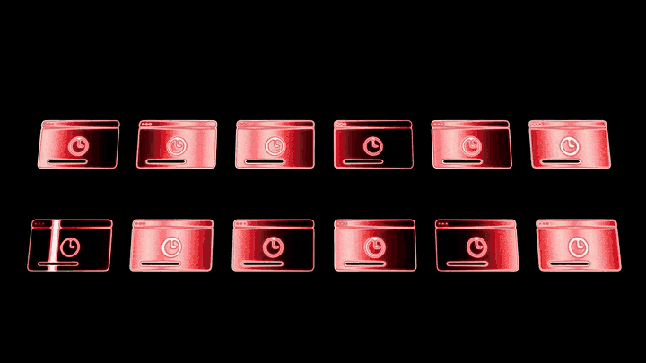
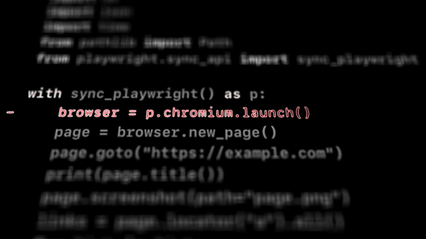

<div align="center">


### One browser engine to rule them all

Stealth Chromium engine · **v3 (Chromium 153)**

[](CHROMIUM_VERSION) [](https://hub.docker.com/r/tilion/fortress) [](https://discord.gg/bfy3fv6QT)<br/>
[](https://raw.githubusercontent.com/tiliondev/fortress/main/AGENTS.md) [](https://raw.githubusercontent.com/tiliondev/fortress/main/llms.txt) [](https://github.com/tiliondev/fortress/tree/main/mcp) [](https://www.npmjs.com/package/tilion-mcp)

**Fortress is a Chromium fork that stops scrapers and browser agents from getting blocked.** Bot detectors flag automation by reading the browser fingerprint. Fortress corrects that fingerprint inside Chromium's C++, so the browser reads as an ordinary Chrome install. Point your existing Playwright or Puppeteer at it over CDP; nothing else in your code changes.

**Headless, on datacenter IPs, with no proxies, Fortress loaded 86.4% of 92 protected sites. The next best stack (Camoufox) loaded 74.5%.**

<p align="center"></p>

<sub>A site reads the fingerprint. Stock Chrome driven by a script fails CreepJS, BrowserScan, rebrowser and the WebGL check and is blocked; Fortress passes all four.</sub>

</div>

<div align="center">

### Real runs, fully headless

<sub>Unedited captures over CDP, with no stealth plugins. Reproduce with <a href="examples/scrape_demos.py"><code>examples/scrape_demos.py</code></a>.</sub>


<table><tr>
<td align="center" width="50%"><br/><sub><b>Auto-pagination</b>: 30 quotes across 3 pages.</sub></td>
<td align="center" width="50%"><br/><sub><b>Deep detail crawl</b>: UPC · price · tax · stock · reviews.</sub></td>
</tr></table>


<sub><b>Akamai, before and after</b>, on aa.com from the same residential IP: a stock browser gets <b>Access Denied</b>, Fortress loads the page and Akamai issues its <code>_abck</code> sensor cookie. Same result on lowes.com, macys.com and kohls.com.</sub>

</div>

## Contents

[Quick start](#quick-start) · [Every session a distinct machine](#every-session-a-distinct-machine) · [The Fortress MCP](#the-fortress-mcp) · [Works with your stack](#works-with-your-stack) · [Why patch the engine](#why-patch-the-engine-not-the-page) · [How Fortress compares](#how-fortress-compares) · [Results](#results) · [Configure the persona](#configure-the-persona) · [Build & verify](#build--verify) · [Reference](#reference)

## Quick start

```bash
pip install tilion-fortress                       # or: npm install tilion-fortress
docker run --rm -p 9222:9222 tilion/fortress:latest   # any OS, raw CDP on :9222
```

```python
from tilion_fortress import Fortress
from playwright.sync_api import sync_playwright

with Fortress() as f:                       # launches the engine on a CDP endpoint
    with sync_playwright() as p:
        browser = p.chromium.connect_over_cdp(f.cdp_url)
        page = browser.new_page()
        page.goto("https://bot.sannysoft.com")
```
```js
import { Fortress } from "tilion-fortress";
import { chromium } from "playwright";

const f = await Fortress.launch();
const browser = await chromium.connectOverCDP(f.cdpUrl);
const page = await browser.newPage();
await page.goto("https://browserscan.net");
```

The pip and npm SDKs download a prebuilt, SHA-256-verified binary (Linux x64, Windows x64). Portable tarballs, a `.deb` and the Windows `.zip` are on [Releases](https://github.com/tiliondev/fortress/releases).

### Free for developers

v3 is free for developers, with no machine, session or concurrency caps. Activate once:

```bash
tilion activate      # sign in with GitHub, Google or email; key saved to ~/.tilion/license.jwt
```

The key is checked offline and Fortress never reports usage. Without activation it still runs, on the public first-generation engine. For CI, Docker and agents, set `TILION_LICENSE_KEY=<key>` or run `tilion activate --token <key>`; one key covers a fleet. Production keys for larger organizations are at [fortress.tilion.com/pricing](https://fortress.tilion.com/pricing).

<details><summary><b>The <code>tilion</code> CLI</b></summary>

<br/>

| Command | What it does |
|---|---|
| `tilion activate` | Unlock v3 with a one-click device flow (browser sign-in) |
| `tilion activate --headless` | Same flow, prints the URL and code (SSH or remote hosts) |
| `tilion activate --token <jwt>` | Save a key with no browser (CI, agents) |
| `tilion license status [--json]` | Show the saved key's tier and expiry (`--json` for scripts) |
| `tilion license refresh` | Re-issue the key before it expires |
| `tilion license logout` | Remove the saved key and drop back to v1 |
| `tilion get [platform]` | Download the build for this host. `tilion get list` shows all: `linux-x64`, `arm64`, `armhf`, `x86`, `win-x64`, `mac-arm64`, `mac-x64` |
| `tilion mcp` | Run the Fortress **MCP server**, stealth browsing as agent tools |
| `tilion` `[--port N]` | Launch the engine and print the CDP endpoint |

</details>

### Platforms

| Platform | Package | Widevine | Status |
|---|---|:---:|---|
| **Linux x64** | portable tarball · Docker · pip / npm |  |  **shipping** |
| **Windows x64** | portable `.zip` + `tillion.cmd` launcher |  |  **shipping** |
| **Linux arm64** | portable tarball (Graviton, dense cloud fleets) | no |  **shipping** |
| **Linux x86 · armhf** | portable tarball (32-bit x86 / ARM) | no |  **shipping** |
| **macOS** (arm64 / x64) | `.app`, built from source |  | build from source |

<sub>The arm64, x86 and armhf builds ship without the bundled Widevine CDM.</sub>

### Set it up with an AI assistant

[](https://chatgpt.com/?q=Help%20me%20set%20up%20Fortress%2C%20a%20stealth%20Chromium%20engine%2C%20for%20my%20browser%20automation.%20First%20read%20the%20setup%20guide%20at%20https%3A%2F%2Fgithub.com%2Ftiliondev%2Ffortress%2Fblob%2Fmain%2FAGENTS.md%20then%20walk%20me%20through%3A%201%29%20launching%20Fortress%20%28Docker%3A%20docker%20run%20-d%20--rm%20-p%209222%3A9222%20tilion%2Ffortress%3Alatest%2C%20or%20pip%2Fnpm%20install%20tilion-fortress%29%2C%202%29%20connecting%20my%20Playwright%20or%20Puppeteer%20code%20over%20CDP%20to%20http%3A%2F%2Flocalhost%3A9222%2C%203%29%20keeping%20my%20existing%20automation%20logic.%20Do%20NOT%20add%20puppeteer-stealth%20or%20JS%20fingerprint%20patches%3B%20Fortress%20spoofs%20the%20fingerprint%20in%20the%20engine%27s%20C%2B%2B.) [](https://claude.ai/new?q=Help%20me%20set%20up%20Fortress%2C%20a%20stealth%20Chromium%20engine%2C%20for%20my%20browser%20automation.%20First%20read%20the%20setup%20guide%20at%20https%3A%2F%2Fgithub.com%2Ftiliondev%2Ffortress%2Fblob%2Fmain%2FAGENTS.md%20then%20walk%20me%20through%3A%201%29%20launching%20Fortress%20%28Docker%3A%20docker%20run%20-d%20--rm%20-p%209222%3A9222%20tilion%2Ffortress%3Alatest%2C%20or%20pip%2Fnpm%20install%20tilion-fortress%29%2C%202%29%20connecting%20my%20Playwright%20or%20Puppeteer%20code%20over%20CDP%20to%20http%3A%2F%2Flocalhost%3A9222%2C%203%29%20keeping%20my%20existing%20automation%20logic.%20Do%20NOT%20add%20puppeteer-stealth%20or%20JS%20fingerprint%20patches%3B%20Fortress%20spoofs%20the%20fingerprint%20in%20the%20engine%27s%20C%2B%2B.) [](https://gemini.google.com/app?q=Help%20me%20set%20up%20Fortress%2C%20a%20stealth%20Chromium%20engine%2C%20for%20my%20browser%20automation.%20First%20read%20the%20setup%20guide%20at%20https%3A%2F%2Fgithub.com%2Ftiliondev%2Ffortress%2Fblob%2Fmain%2FAGENTS.md%20then%20walk%20me%20through%3A%201%29%20launching%20Fortress%20%28Docker%3A%20docker%20run%20-d%20--rm%20-p%209222%3A9222%20tilion%2Ffortress%3Alatest%2C%20or%20pip%2Fnpm%20install%20tilion-fortress%29%2C%202%29%20connecting%20my%20Playwright%20or%20Puppeteer%20code%20over%20CDP%20to%20http%3A%2F%2Flocalhost%3A9222%2C%203%29%20keeping%20my%20existing%20automation%20logic.%20Do%20NOT%20add%20puppeteer-stealth%20or%20JS%20fingerprint%20patches%3B%20Fortress%20spoofs%20the%20fingerprint%20in%20the%20engine%27s%20C%2B%2B.) [](https://raw.githubusercontent.com/tiliondev/fortress/main/AGENTS.md)

## Every session a distinct machine

<p align="center"></p>

Each launch mints a fresh, internally coherent machine: GPU, screen, cores, timezone, language and fonts all agree. The persona reaches the renderer over IPC, so nothing shows on the command line and every `BrowserContext` can hold its own identity. Across 40 back-to-back launches of the same binary:

| Across 40 launches | Distinct |
|---|:---:|
| **Canvas** fingerprint | **40 / 40** |
| **Audio** fingerprint | **40 / 40** |
| GPU (WebGL renderer) | 25 |
| Screen resolution | 14 |
| Timezone (geo-coherent with language) | 23 |
| Platform mix | 31 Windows · 9 macOS |

<sub>Reproduce with <code>tools/gauntlet.py --runs 40</code>. A 64-clone fleet resumed from one snapshot comes up 48/48 distinct, because <code>on_restore</code> re-keys the whole persona with no relaunch.</sub>

## The Fortress MCP


A [Model Context Protocol](https://modelcontextprotocol.io) server that gives Claude, Codex, Cursor, Windsurf, Cline or any MCP client a stealth browser as **29 tools**, local and free. When a plain fetch is blocked, the agent calls a tool and gets the page.

<p align="center"></p>

```bash
pip install "tilion[mcp]"                  # or zero-install: npx -y tilion-mcp
claude mcp add fortress -- tilion-mcp      # Claude Code
```

For Claude Desktop, Cursor (`~/.cursor/mcp.json`), Cline and Windsurf, add the same block to the client's MCP config:

```json
{ "mcpServers": { "fortress": { "command": "tilion-mcp" } } }
```

| | tools |
|---|---|
| **Get blocked pages** | `fetch_protected_page` · `read_page` · `get_page_html` · `search_web` |
| **Structured data** | `extract_page` (schema-aware) · `extract_document` (PDF/DOCX/XLSX) |
| **Whole sites** | `crawl_site` (auto-SPA) · `recon_site_apis` (find the private JSON API) |
| **Drive a page** | `page_elements` · `click_button` · `fill_field` · `press_key` · `wait_for` · `evaluate_js` |
| **Multi-step flows** | `run_browser_task` (login, paginate, infinite-scroll, checkout, …) |
| **Capture / auth** | `screenshot_page` · `save_page` · `download_file` · `save_profile` / `load_profile` |
| **Bring your own** | `get_stealth_cdp_endpoint`: a CDP url for Playwright / Puppeteer / browser-use |

The full tool reference, benchmarks and agent skill are in [`mcp/`](mcp/README.md).

## Works with your stack

<p align="center"></p>

With Fortress running (Docker or the `tilion` command), one line changes: `launch()` becomes `connect_over_cdp("http://localhost:9222")`.

| Framework | Connect via |
|---|---|
| [**browser-use**](https://github.com/browser-use/browser-use) (~70k stars) | `cdp_url="http://localhost:9222"` |
| [**Crawl4AI**](https://github.com/unclecode/crawl4ai) (~58k stars) | CDP endpoint |
| [**Stagehand**](https://github.com/browserbase/stagehand) (~21k stars) | `connectOverCDP` |
| [**LangChain**](https://github.com/langchain-ai/langchain) Playwright toolkit | Playwright CDP |
| **Playwright / Puppeteer** (Python & JS) | `connect_over_cdp` / `connect` |
| **Fortress MCP** + `pip install tilion` facade | tools for agents, raw CDP underneath |

## Why patch the engine, not the page

A JavaScript stealth patch is a function standing where a native one belongs, and detectors check for exactly that:

| The tell | Why it catches a JS spoof |
|---|---|
| `toString` self-reveal | A native method stringifies to `function get vendor() { [native code] }`; an override stringifies to its own source, so one `.toString()` catches it. |
| Descriptor and `hasOwnProperty` | `getOwnPropertyDescriptor` exposes redefined props, and `hasOwnProperty('toString')` returns `true` on a tampered function where a native one returns `false`. |
| `failsTypeError` | Native getters throw a specific `TypeError` on the wrong `this`; a naive shim stays quiet, and the silence is the signal. |

Realm re-acquisition defeats every main-world patch. A detector takes a pristine primitive from another realm and turns it on your function:

```js
const iframe = document.createElement('iframe'); document.body.appendChild(iframe);
const realToString = iframe.contentWindow.Function.prototype.toString;
realToString.call(navigator.__lookupGetter__('vendor')); // returns your source code. Caught.
```

In Fortress the getter for `navigator.vendor` **is** the C++ getter. It reports `[native code]` because it is native code, the same in every frame and worker. Fortress applies the Camoufox idea to **V8 and Blink**, so the fingerprint matches a Chrome user agent by construction.

### The four layers of bot detection

| Layer | The tells | Where the fix lives | Fortress |
|---|---|---|---|
| **A: driver / binary artifacts** | `cdc_` ChromeDriver vars, WebDriver protocol surface | Drive raw CDP, skip chromedriver |  built to be driven this way |
| **B: CDP side-effects** | `Runtime.enable` leaks via sourceURL + init-script footprints, however clean the binary is | The control / CDP-client layer: hold back `Runtime.enable`, use `Runtime.addBinding` + isolated worlds |  no leak (verified on rebrowser) |
| **C: fingerprint surface** | canvas, WebGL, WebGPU, audio, fonts, navigator, across main frame, iframes, workers | The engine (C++), because JS overrides self-reveal |  **this is Fortress** |
| **D: network / IP egress** | datacenter ASN, IP reputation, geo-vs-persona mismatch | Your proxies (residential / mobile), or the Tilion hosted version |  bring your own with the self-hosted engine; available on the Tilion hosted version, waitlist at [tilion.com](https://tilion.com) |

Fortress is the Layer C engine, built to be driven so A and B hold too, and to stay geo-coherent (timezone, locale, WebRTC) once you bring a Layer D IP.

## How Fortress compares

| | Stock Playwright | puppeteer-extra-stealth | undetected-chromedriver | Camoufox | Antidetect apps¹ | **Fortress v3** |
|---|:---:|:---:|:---:|:---:|:---:|:---:|
| Spoof layer | none | JS injection | CDP/config patch | **C++ engine (Firefox)** | **C++ engine** | **C++ engine (Chromium)** |
| `toString` yields `[native code]` | n/a |  | n/a |  |  |  |
| Survives realm re-acquisition (iframe/worker) |  |  |  |  |  |  |
| No `Runtime.enable` leak |  |  |  |  |  |  |
| Engine = Chrome / **V8** (majority traffic) |  |  |  |  Firefox |  |  |
| Coherent Chromium TLS shape |  |  |  |  Firefox |  |  |
| Parameter-level WebGL **+ WebGPU** coherence | n/a |  |  |  no WebGPU | varies |  |
| Per-launch fleet **dynamism** (distinct machine) |  |  |  |  |  persistent by design |  48/48 |
| Full-persona **re-key on snapshot resume** |  |  |  |  |  |  `on_restore` |
| Native single-surface C++ patch engine | n/a | n/a | n/a |  |  closed |  81 patches |
| **States its own limits** | n/a | n/a | n/a |  |  |  |

<sub>¹ Multilogin / GoLogin / Dolphin / Nstbrowser: closed-source engine patches, persistent identity by design, bundled residential egress (their Layer-D advantage over Fortress).</sub>

Fortress builds on prior art: [`fingerprint-chromium`](https://github.com/adryfish/fingerprint-chromium), [`ChromiumFish`](https://github.com/arman-bd/chromiumfish) and CloakBrowser came first, and Camoufox, Multilogin, GoLogin and Dolphin also patch engine C++. Fortress's edge is the combination: the broadest native surface set on a Chromium base, fleet dynamism with `on_restore`, and parameter-level coherence. Where it is behind: IP egress (bring your own) and behavioral humanization beyond mouse motion.

<details><summary><b>What changed from v2 to v3</b></summary>

<br/>

| Axis | v2 | **v3** |
|---|---|---|
| Chromium base | 151 / 152 | **153.0.8010.36** |
| Single-surface C++ patches | ~34 | **81** |
| Persona transport | command line, per launch, host-readable | **IPC-delivered, in-process, per-context isolated** |
| Multi-identity in one binary | one persona per process | **per-`BrowserContext` isolation** |
| Snapshot resume | relaunch to change identity | **`on_restore` full-persona re-key, no relaunch** |
| Fleet distinctness | not measured | **48/48 across 64 clones** (500-clone stress-gated) |
| Canvas noise | seeded | **idempotent, byte-exact cross-path, 64-bit seeds, fail-closed** |
| WebGL | renderer **string** only (incoherent numbers) | **parameter-level** limits + extensions + string, per backend |
| WebGPU | absent / software-backend tell | **coherent with the persona GPU** + per-clone variation |
| Fonts | metric substitutes (~33) | **154-family substrate**, enumeration gated to the persona |
| Client-Hints | UA basics | **full Sec-CH-UA + Device-Memory on the navigation path** |
| `prefers-color-scheme` | fleet-uniform | **per persona (about a third dark)** |
| Mouse motion | raw driver | **recorded-human trajectories** (~10k paths, ~16× more human) |
| DRM | no Widevine | **real Widevine CDM bundled**, EME verified |

[Full release notes](https://github.com/tiliondev/fortress/releases)

</details>

## Results

### Benchmark: 92 protected sites, eight stacks

Run on 2026-09-28 from US-East cloud machines, headless, on datacenter IPs with no proxies. Every tool loaded every target twice, each time on a fresh machine destroyed afterwards (1,584 machines). A run counts only if the real page loaded with no challenge or deny page. Method and target list: [docs/BENCHMARK.md](docs/BENCHMARK.md).

| Stack | Served | n | 95% range |
|---|:---:|:---:|:---:|
| **Fortress** | **86.4%** | 159/184 | 81 to 91 |
| Camoufox | 74.5% | 137/184 | 68 to 80 |
| puppeteer-extra + stealth | 72.3% | 133/184 | 65 to 78 |
| Brave | 36.4% | 67/184 | 30 to 44 |
| nodriver | 35.9% | 66/184 | 29 to 43 |
| stock Chrome | 34.2% | 63/184 | 28 to 41 |
| patchright | 34.2% | 63/184 | 28 to 41 |
| undetected-chromedriver | 33.7% | 62/184 | 27 to 41 |

<sub>95% Wilson intervals; Fortress's does not overlap the next stack's. Fortress got 2/2 on ten sites where neither Camoufox nor puppeteer-stealth got more than 1/2, and there is no site where it got 0/2 while either of them got 2/2. A repeat run the same day scored 85.3%.</sub>

### Live detectors

Headless, from a datacenter IP, on the v3 binary. Reproduce with `tools/gauntlet.py --bundle ./fortress-v153`; dated re-runs are in [docs/GAUNTLET_RESULTS.md](docs/GAUNTLET_RESULTS.md).

| Suite | Stock Chromium | **Fortress v3** |
|---|:---:|:---:|
| **CreepJS** | flagged headless | **0% headless · 0% stealth**, worker signals coherent |
| **bot.sannysoft.com** | red rows | **0 failed** · every intoli + PHANTOM_/HEADCHR_ check green · `navigator.webdriver` undefined |
| **browserscan.net** | bot detected | **“Normal: No bots detected, could be a human”** · WebDriver / Selenium / PhantomJS / Headless / CDP / DevTool all *Normal* |
| **BrowserLeaks · WebGL** | SwiftShader leak | Unmasked **`ANGLE (Intel HD Graphics, Direct3D11)`** with fully coherent D3D11 parameters |
| **WebGPU** *(secure context)* | software-backend tell | `navigator.gpu` coherent with the persona GPU: adapter identity, limits, subgroup sizes *(verified)* |
| **AmIUnique · pixelscan · iphey** | automation flags | consistent, no automation flags |
| **rebrowser bot-detector** | `Runtime.enable` LEAK | **no leak** · `webdriver=false` · clean init-scripts (raw CDP) |
| **64-clone fleet** | one shared identity | **48/48 distinct** canvas / audio / `Math.random` (fleet gate) |
| **Cloudflare Turnstile** | blocked | **cleared**: a human click cleared a live challenge (headed, datacenter IP) |

<div align="center">
&nbsp;&nbsp;&nbsp;
</div>

<p align="center"></p>

<sub>Unedited capture in a real window: Fortress clears a live <b>Cloudflare</b> challenge, turns <b>bot.sannysoft.com</b> all green and reads <b>BrowserScan</b> "Normal".</sub>

## Configure the persona

The default is a fresh coherent persona per launch, delivered over IPC. Pin or override any surface with `--uxr-*` switches:

```
--uxr-platform / --uxr-ua-platform / --uxr-ua-os / --uxr-ua-arch / --uxr-ua-bitness
--uxr-ua-platform-version / --uxr-ua-brand / --uxr-hw-concurrency / --uxr-device-memory
--uxr-webgl-vendor / --uxr-webgl-renderer / --uxr-webgl-fullparams / --uxr-webgpu-vendor
--uxr-canvas-seed / --uxr-audio-seed / --uxr-timezone / --uxr-languages / --uxr-color-scheme
--uxr-screen-width / --uxr-screen-height / --uxr-webrtc-policy=disable_non_proxied_udp
```

| Env var | Purpose |
|---|---|
| `TILION_NO_DEFAULTS=1` | Skip the default persona (bare launch) |
| `TILION_TZ` / `TILION_LANG` | Quick timezone / language override |

Every flag, env var and coherence rule: [docs/UXR_CONFIG.md](docs/UXR_CONFIG.md).

## Build & verify

```bash
export CHROMIUM_VERSION=$(cat CHROMIUM_VERSION)   # 153.0.8010.36
build/build.sh                         # depot_tools, sync the tag, apply patches, gn gen, ninja
build/rebase-monthly.sh 154.0.XXXX.0   # bump + 3-way apply + rebuild + gauntlet-gate
```

Output: `out/Fortress/chrome`. The fork is 81 single-surface patches, and the gauntlet gates every release. The first-generation patch series is public and rebuilds with the same script.

Fortress ships only from these channels:

| | Official source |
|---|---|
| **Source** | [github.com/tiliondev/fortress](https://github.com/tiliondev/fortress) |
| **Docker** | [`tilion/fortress`](https://hub.docker.com/r/tilion/fortress) |
| **Python** | [`tilion-fortress`](https://pypi.org/project/tilion-fortress/) |
| **Node** | [`tilion-fortress`](https://www.npmjs.com/package/tilion-fortress) |

Every release ships `SHA256SUMS` (the SDKs check it on install). Verify the Docker image by digest against the release notes:

```bash
BASE=https://github.com/tiliondev/fortress/releases/download/v153.0.8010.36
curl -LO $BASE/fortress-v153-linux-x64.tar.gz
curl -Ls $BASE/SHA256SUMS | sha256sum -c --ignore-missing     # -> OK
docker inspect --format '{{index .RepoDigests 0}}' tilion/fortress:153.0.8010.36
```

## Reference

<details><summary><b>Troubleshooting</b></summary>

<br/>

**Still blocked on Cloudflare, DataDome or Kasada.** Usually the IP: datacenter ranges are flagged before any page script runs. Retry through a residential or mobile proxy; if it clears, the fingerprint was fine. Tilion Cloud runs Fortress on residential egress (waitlist at [tilion.com](https://tilion.com)).

**The fingerprint looks off on a Linux host.** The default persona is Windows, but TLS and some OS signals follow the host. Match the persona to your egress OS with `--uxr-*`, or run the native Windows build.

**macOS.** Run the Docker image or build the `.app` from source.

**A detector flags something the gauntlet passes.** Confirm you are on the current rebase, then email **team@tilion.dev** with the test page.

</details>

<details><summary><b>FAQ</b></summary>

<br/>

**Does Fortress work with Selenium?** Drive it over CDP. chromedriver adds the driver artifacts Fortress is built to avoid.

**How is it different from puppeteer-stealth, undetected-chromedriver, nodriver and patchright?** Those patch the JavaScript or CDP layer, which `toString` and realm re-acquisition reveal, and headless they send `HeadlessChrome` in the user agent. In the benchmark they loaded 34 to 36% (puppeteer-stealth 72.3%) against Fortress's 86.4%.

**How is it different from Camoufox?** Same engine-level idea. Camoufox forks Firefox; Fortress forks Chromium/V8, the majority engine, and adds WebGPU coherence and `on_restore` fleet re-identity. Benchmark: 86.4% vs 74.5%.

**Is it an alternative to Multilogin, GoLogin, Kameleo, AdsPower or Dolphin?** Those are closed-source builds sold as persistent profiles with bundled proxies. Fortress is an engine you run yourself, with a fresh identity per launch, published first-generation patches and no telemetry.

**Does it run headless?** Yes. The benchmark is headless, and headless and headed launches present the same fingerprint.

**Do I still need proxies?** For sites that block datacenter ranges, yes. Fortress keeps timezone, locale and WebRTC coherent with whatever exit you use.

**Is it open source? What does it cost?** Source-available under the [Fortress Source Available License 1.1](LICENSE); see [License](#license).

**Is this legal?** Fortress is for legitimate automation, testing and scraping of public data. Respect each site's terms and your local law.

**Will it pass everything forever?** No. Detection moves, so Fortress rebases on Chromium monthly and publishes a dated, reproducible gauntlet.

</details>

<details><summary><b>Roadmap</b></summary>

<br/>

- [ ] First-party residential and mobile egress, wired to the existing geo-coherence
- [ ] Keystroke and scroll variance (mouse motion has shipped)
- [ ] TLS ClientHello (JA3/JA4) in the persona surface set
- [ ] Linux arm64 / x86 / armhf tarballs (rolling out) and a macOS `.app`
- [ ] Code-signed Windows `.exe` and macOS `.app`

Shipped in v3: the IPC persona with per-context isolation, `on_restore`, parameter-level WebGL and WebGPU, recorded-human mouse motion, the Widevine CDM, the native Windows build, the MCP server and the 92-site benchmark.

</details>

<details><summary><b>Repo layout</b></summary>

```
patches/     the first-generation C++ patch series (Fortress Source Available License 1.1)
build/       args.gn, build.sh, apply-patches.sh, rebase-monthly.sh, windows/, macos/
packaging/   tilion launcher, fonts.conf, Dockerfile, .deb + bundle builders
fonts/       222 metric-compatible OS-named font files (154 distinct families, incl. color emoji)
sdk/         python + node (tilion-fortress) prebuilt-binary SDKs
mcp/         the Fortress MCP server (29 tools) and the agent skill
tools/       gauntlet.py, the CreepJS / Sannysoft / BrowserScan CI gate
docs/        UXR_CONFIG (the --uxr-* reference), GAUNTLET_RESULTS, BENCHMARK
```

</details>

### Contributing

Fortress does not accept outside pull requests; see [CONTRIBUTING.md](CONTRIBUTING.md). Found a detection vector or a leak? Email **team@tilion.dev** with a reproducible test page.

### License

**Fortress Source Available License 1.1.** Free to read, modify, rebuild and redistribute, and to use for development, testing and evaluation at any size. Production use is free for individuals and for organizations under US$500,000 in cumulative funding and US$300,000 or less in ARR; other organizations need one flat subscription ([fortress.tilion.com/pricing](https://fortress.tilion.com/pricing), [LICENSE](LICENSE), [SUBSCRIPTION-TERMS.md](SUBSCRIPTION-TERMS.md)). Earlier BSD-licensed releases keep their BSD permissions ([LICENSE-BSD-LEGACY](LICENSE-BSD-LEGACY)). Chromium and the bundled fonts keep their own licenses ([NOTICE](NOTICE)).
